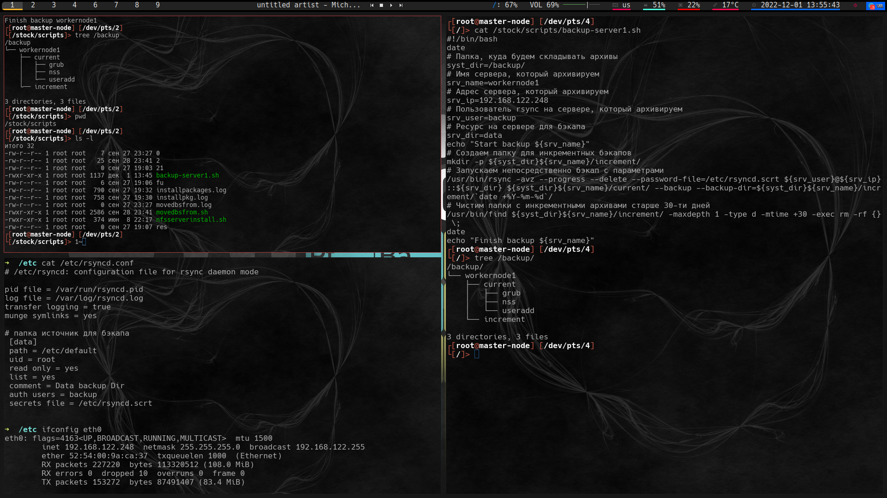

# Домашнее задание к занятию "`10.4 Резервное копирование`" - `Мартыненко Алексей`

---

### Задание 1

`Приведите ответ в свободной форме........`

объект для сравнения - база данных
--
полное копирование - создание полной копии базы данных в момент времени (алгоритм состоит из “одного” этапа)

дефференциальное резервное копирование - создание изменений от основного бэкапа за отчетный период времени (алгоритм - создание полного бэкапа, при наличии изменений создания бэкапа изменений от полного бэкапа), можно ограничиться 2 элементами стека - база + различия на момент создания

инкрементное резервное копирование - создание полного бэкапа, + создание бэкапа изменений, - каждый  заявленный период/при наличии изменений, имеют линейную связность 

---

### Задание 2

---

### Задание 3

