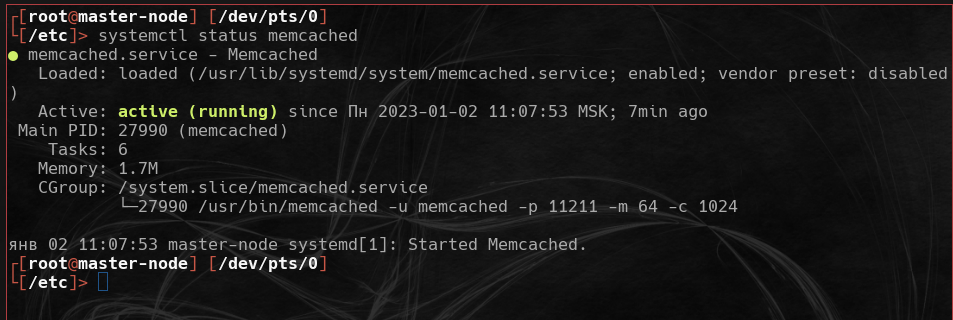
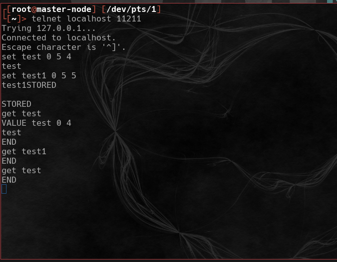
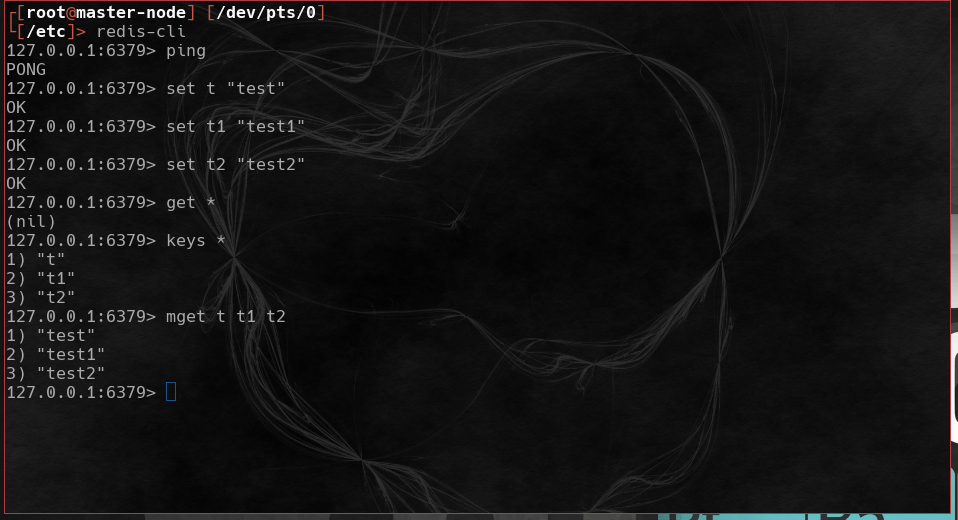
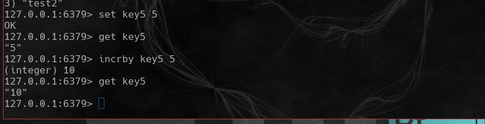

# Домашнее задание к занятию "`11.2 Кеширование Redis/memcached`" - `Мартыненко Алексей`

---

### Задание 1. Кеширование
Приведите примеры проблем, которые может решить кеширование.
Приведите ответ в свободной форме.

+ сокращение времени на обработку запросов http/https засчет размещения данных по  ранее запрошенным url в кэше
+ сокращение времени на обработку запросов при обращении к базе данных, когда есть приложение, работающее по tcp/ip формирующий тяжелый и сложный отчет, при одинаковых входных параметрах для хранимой процедуры, которая формирует отчет, данные по этому отчету остаются актуальными в течении суток/недели/месяца+ 
+ значительно сокращение времени процесса авторизации, если есть механизм кэширования и размещения неизменных данных по профилю пользователя в кэше
+ размещение готовых ответов dns серверов в кэше, что позволяет почти мнгновенно получать без обработного резолва актуальный ip по доменному имени в запросе
+ размещение в кэше кода неизменяемых js библиотек, по этому принципу функционируют все cdn

вообще любая архитектура в которой есть признаки - условно неизменяемых данных, множества обращений для получения этих данных в "единицу времени" может быть подвергнута рассмотрению для внедрения кэша для оптимизации работы

### Задание 2. Memcached
Установите и запустите memcached.
Приведите скриншот systemctl status memcached, где будет видно, что memcached запущен.

### Задание 3. Удаление по TTL в Memcached
Запишите в memcached несколько ключей с любыми именами и значениями, для которых выставлен TTL 5.
Приведите скриншот, на котором видно, что спустя 5 секунд ключи удалились из базы.

### Задание 4. Запись данных в Redis
Запишите в Redis несколько ключей с любыми именами и значениями.
Через redis-cli достаньте все записанные ключи и значения из базы, приведите скриншот этой операции.

Дополнительные задания (со звёздочкой*)
Эти задания дополнительные, то есть не обязательные к выполнению, и никак не повлияют на получение вами зачёта по этому домашнему заданию. Вы можете их выполнить, если хотите глубже разобраться в материале.

### Задание 5*. Работа с числами
Запишите в Redis ключ key5 со значением типа "int" равным числу 5. Увеличьте его на 5, чтобы в итоге в значении лежало число 10.
Приведите скриншот, где будут проделаны все операции и будет видно, что значение key5 стало равно 10.

