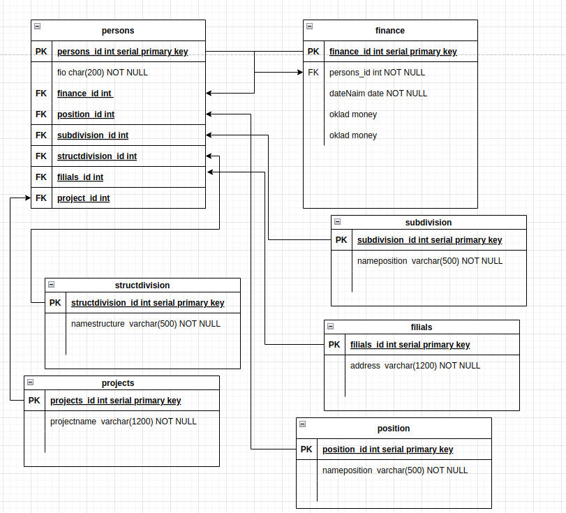

# Домашнее задание к занятию "`12.1 Базы данных`" - `Мартыненко Алексей`

---
Легенда
Заказчик передал вам файл в формате Excel, в котором сформирован отчёт.

На основе этого отчёта нужно выполнить следующие задания.

Задание 1
Опишите не менее семи таблиц, из которых состоит база данных:

какие данные хранятся в этих таблицах;
какой тип данных у столбцов в этих таблицах, если данные хранятся в PostgreSQL.
Приведите решение к следующему виду:

Сотрудники (

идентификатор, первичный ключ, serial,
фамилия varchar(50),
...
идентификатор структурного подразделения, внешний ключ, integer).
```sql92
1 - сотрудники
    persons (
        persons_id = идентификатор, первичный ключ, serial
        FIO = ФИО сотрудника, char(200) not null 
)

```
```sql92
2 - финансы 
    finance (
        finance_id = идентификатор, первичный ключ, serial
        persons_id = внешний ключ, int not null
        dateName = дата найма, date not null
        oklad = сумма оклада, money 
)
```
```sql92
3 - должность
    positions (
        positions_id = идентификаторв, первичный ключ, serial
        nameposition = должность, varchar(500) not null
)
```
```sql92
4 - тип подразделения
    subdivision (
        subdivision_id = идентификаторв, первичный ключ, serial
        nameposition = тип подразделения, varchar(500) not null
)
```
```sql92
5 - структурное подразделение
    structdivision (
        structdivision_id = идентификаторв, первичный ключ, serial
        namestructure = структурное подразделение, varchar(500) not null
)
```

```sql92
6 - филиалы
    filials (
        filials_id = идентификаторв, первичный ключ, serial
        address = филиал, varchar(1200) not null
)
```
```sql92
7 - проекты
    projects (
        projects_id = идентификаторв, первичный ключ, serial
        projectname = проект, на который назначен, varchar(1200) not null
)
```



