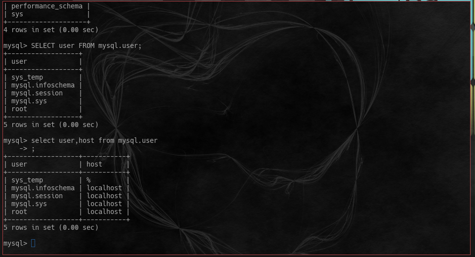
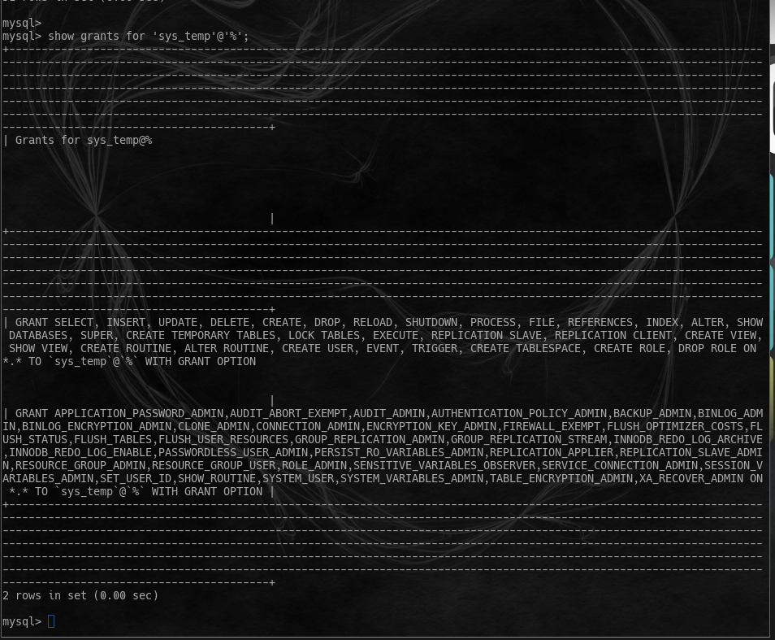
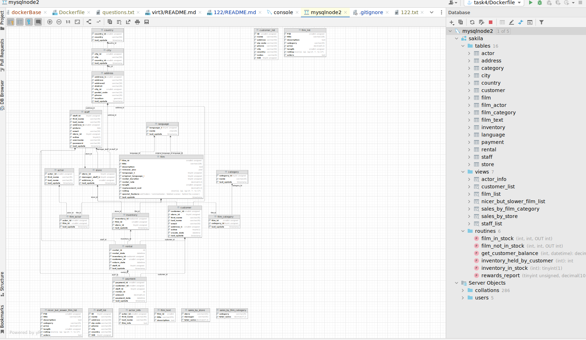
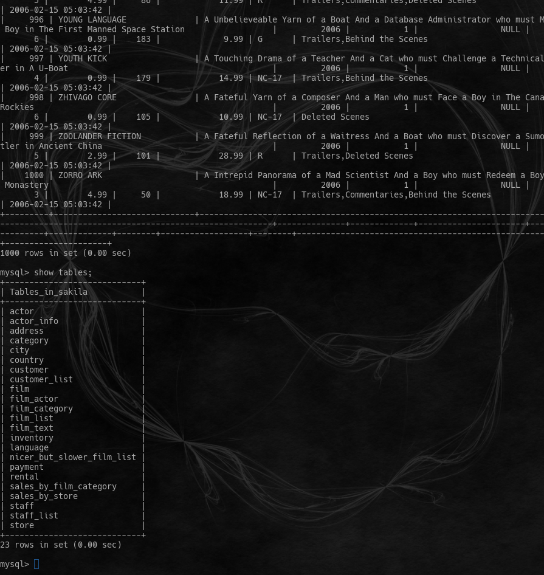
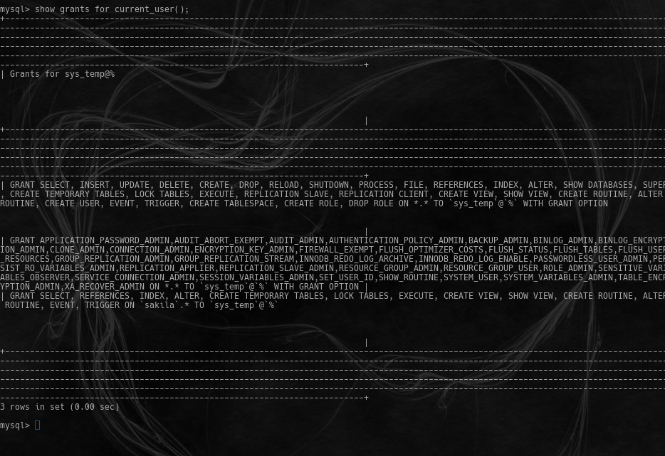

# Домашнее задание к занятию "`12.2. «Работа с данными (DDL/DML)»`" - `Мартыненко Алексей`


## Задание 1
1.1. Поднимите чистый инстанс MySQL версии 8.0+. Можно использовать локальный сервер или контейнер Docker.
1.2. Создайте учётную запись sys_temp.
1.3. Выполните запрос на получение списка пользователей в базе данных. (скриншот)

1.4. Дайте все права для пользователя sys_temp.
1.5. Выполните запрос на получение списка прав для пользователя sys_temp. (скриншот)

1.6. Переподключитесь к базе данных от имени sys_temp.
Для смены типа аутентификации с sha2 используйте запрос:
```sql92
    ALTER USER 'sys_test'@'localhost' IDENTIFIED WITH mysql_native_password BY 'password';
```
1.6. По ссылке https://downloads.mysql.com/docs/sakila-db.zip скачайте дамп базы данных.
1.7. Восстановите дамп в базу данных.
1.8. При работе в IDE сформируйте ER-диаграмму получившейся базы данных. 
При работе в командной строке используйте команду для получения всех таблиц базы данных.(скриншот)


Результатом работы должны быть скриншоты обозначенных заданий, а также простыня со всеми запросами.
```html
CREATE USER 'sys_temp'@'%' IDENTIFIED BY 'secretpassword';
SELECT user FROM mysql.user;
select user, host from mysql.user;
GRANT ALL PRIVILEGES ON *.* TO 'sys_temp'@'%' WITH GRANT OPTION;
FLUSH PRIVILEGES;
show grants for 'sys_temp'@'%';
create database sakila;
mysql -u sys_temp -p sakila < sakila-schema.sql
mysql -u sys_temp -p sakila < sakila-data.sql
use database sakila;
show tables;

```


## Задание 2
Составьте таблицу, используя любой текстовый редактор или Excel, в которой должно быть два столбца: в первом должны быть названия таблиц восстановленной базы, во втором названия первичных ключей этих таблиц. Пример: (скриншот/текст)


 | table      | keys |
 | ----------- | ----------- |
 | actor      | actor_id       |
 | address   | address_id        |
 | category | category_id |
 | city | city_id |
 | country | country_id |
 | customer | customer_id |
 | film | film_id |
 | film_actor | actor_id,film_id |
 | film_category | film_id, category_id |
 | film_text | film_id|
 | inventory | inventory_id |
 | language | language_id |
 | payment | payment_id |
 | rental | rental_id |
 | staff | staff_id |
 | store | store_id  |


Дополнительные задания (со звёздочкой*)
Эти задания дополнительные, то есть не обязательные к выполнению, и никак не повлияют на получение вами зачёта по этому домашнему заданию. Вы можете их выполнить, если хотите глубже шире разобраться в материале.

## Задание 3*
 #### 3.1. Уберите у пользователя sys_temp права на внесение, изменение и удаление данных из базы sakila.

 #### 3.2. Выполните запрос на получение списка прав для пользователя sys_temp. (скриншот)
Результатом работы должны быть скриншоты обозначенных заданий, а также простыня со всеми запросами.



```html
 revoke insert,delete,drop,update, create on sakila.* from 'sys_temp'@'%';
 FLUSH PRIVILEGES;
 SHOW GRANTS FOR current_user();

```

