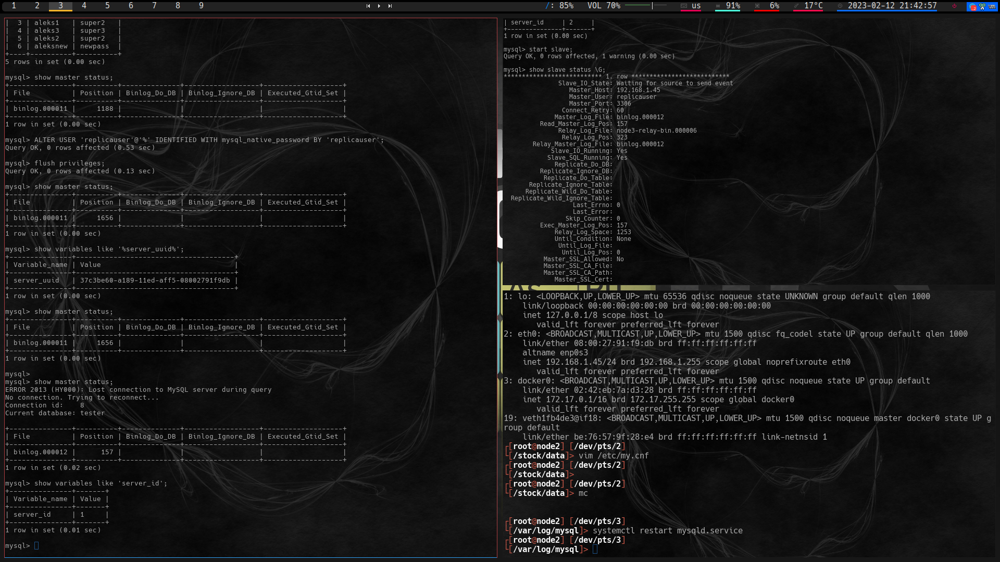
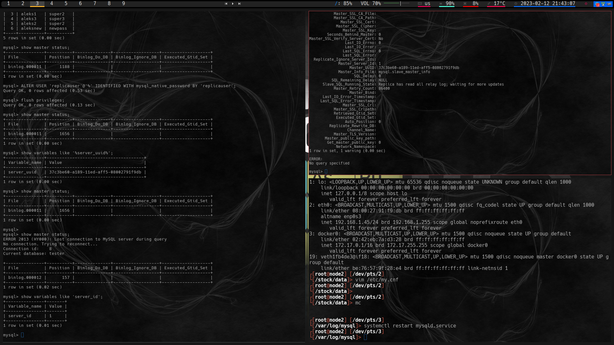
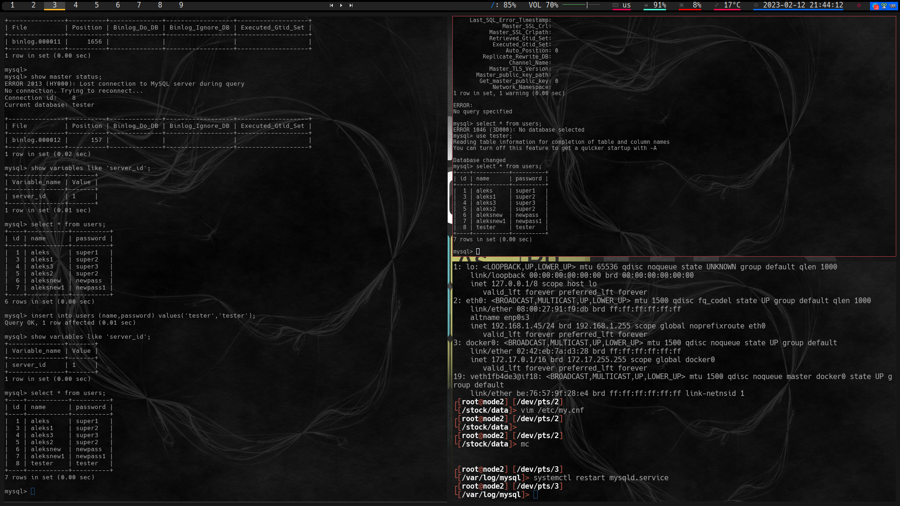
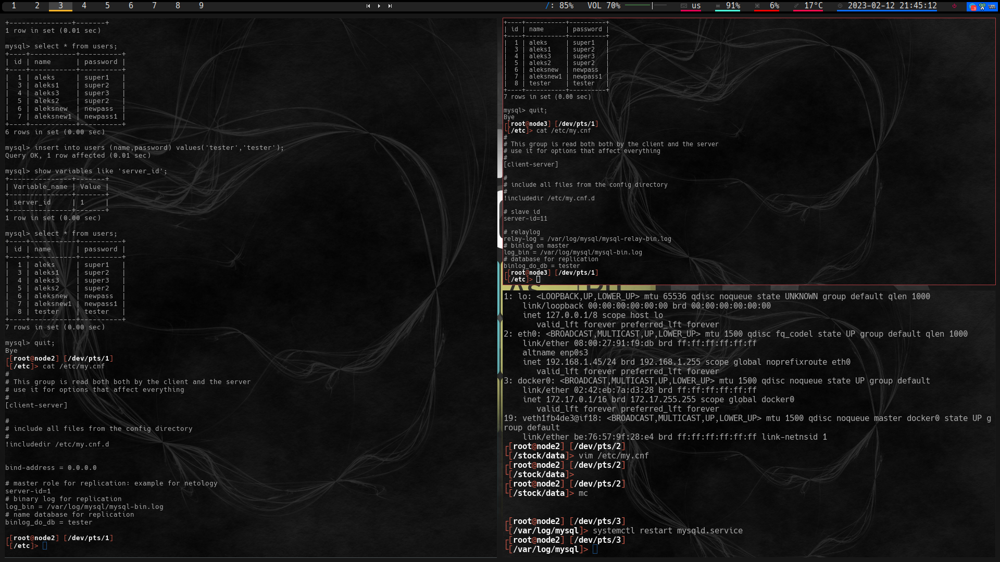
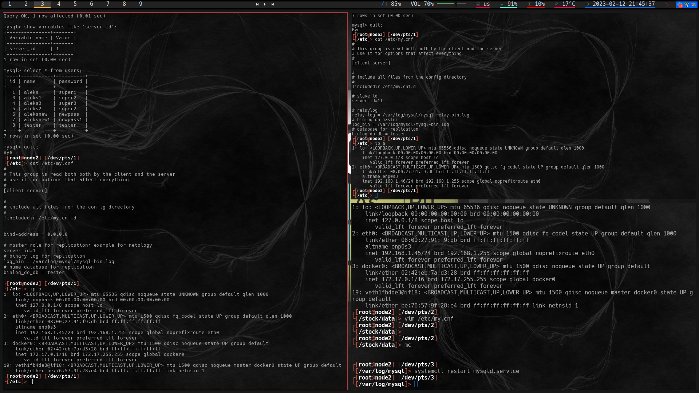
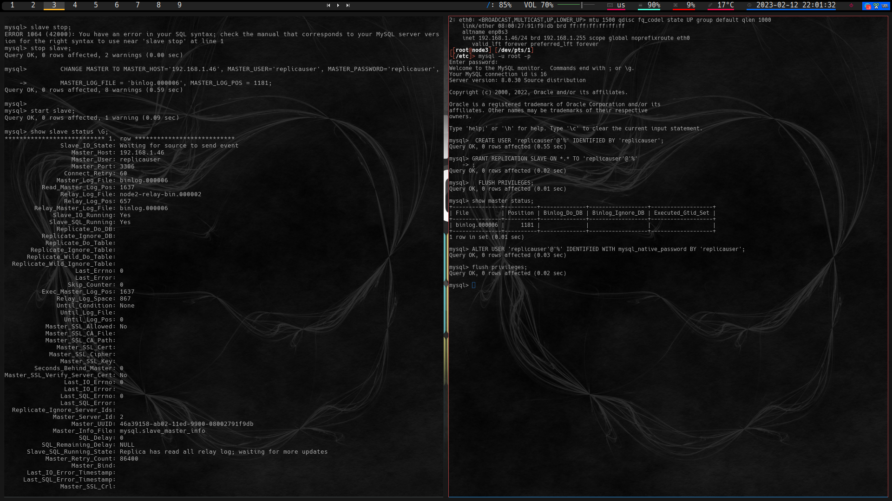
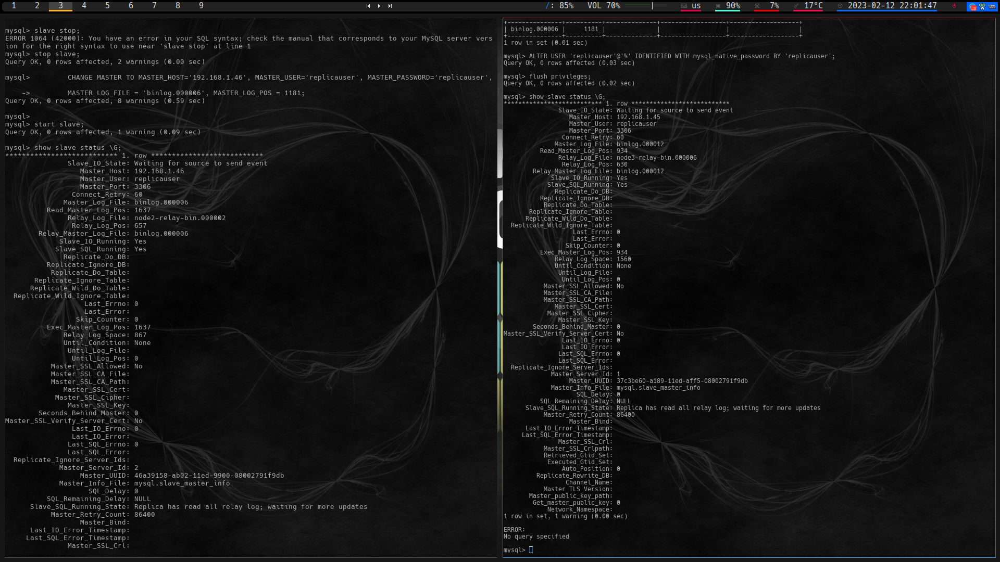
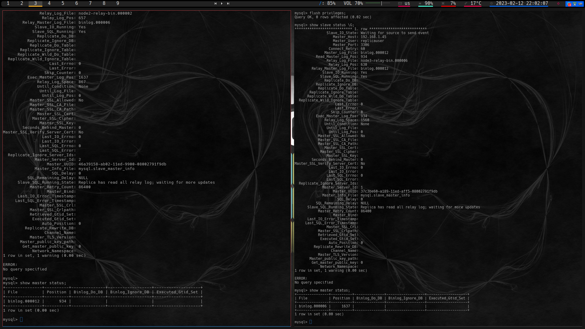

# Домашнее задание к занятию "12.6. «Репликация и масштабирование. Часть 1" - `Мартыненко Алексей`

### Задание 1
На лекции рассматривались режимы репликации master-slave, master-master, опишите их различия.
Ответить в свободной форме.

 master-slave =  характерен тем, что есть master-база , задача которой является 
получение потока данных для обработки и сохранения с синхронной/асинхронной передачи 
этих данных на баз(ы)у-реплики(у). Мастер-база - доступна как на запись данных из вне так и на чтение данных
slave-базы в режиме репликации работают,- в части реплики (получение данных от "корневой" базы-мастера) и  создание консистентности между собой 
и обработку на "чтение" внешних подключений, в slave нельзя осуществить запись используя внешние подключения

master-master = в этом режиме каждя база является равноправным участником репликационного обмена,
обмен в данном случае двусторонний, может быть реализован как асинхронно так и синхронно 
обе(не обязательно 2) базы доступны как на чтение так и на запись. По сути мастер-мастер = это
существование в реальном времени зеркальных копий "набора данных"

### Задание 2
Выполните конфигурацию master-slave репликации, примером можно пользоваться из лекции.
Приложите скриншоты конфигурации, выполнения работы: состояния и режимы работы серверов.

Дополнительные задания (со звёздочкой*)
Эти задания дополнительные, то есть не обязательные к выполнению, и никак не повлияют на получение вами зачёта по этому домашнему заданию. Вы можете их выполнить, если хотите глубже шире разобраться в материале.

### Задание 3*
Выполните конфигурацию master-master репликации. Произведите проверку.

Приложите скриншоты конфигурации, выполнения работы: состояния и режимы работы серверов.

