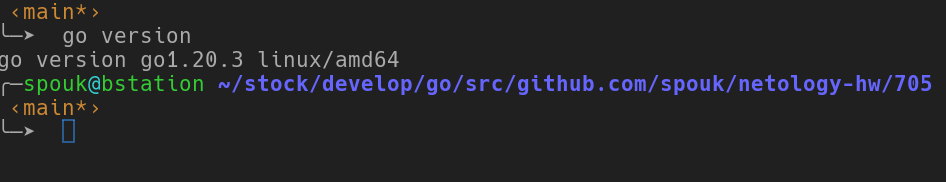
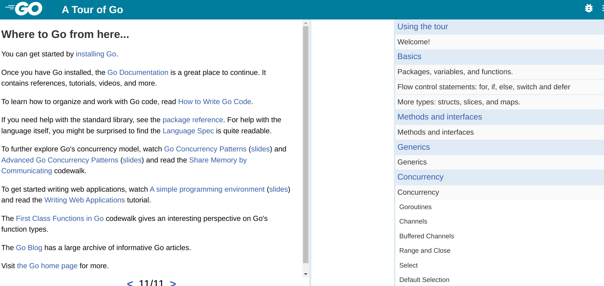

# Домашнее задание к занятию   5. «Основы Golang» - `Мартыненко Алексей`


### Задача 1. Установите Golang
Воспользуйтесь инструкций с официального сайта: https://golang.org/.
Также для тестирования кода можно использовать песочницу: https://play.golang.org/.



### Задача 2. Знакомство с gotour
У Golang есть обучающая интерактивная консоль https://tour.golang.org/. Рекомендуем изучить максимальное количество примеров. В консоли уже написан необходимый код, осталось только с ним ознакомиться и поэкспериментировать, как написано в инструкции в левой части экрана.


### Задача 3. Написание кода
Цель этого задания — закрепить знания о базовом синтаксисе языка. Можно использовать редактор кода на своём компьютере или песочницу: https://play.golang.org/.

>Напишите программу для перевода метров в футы (1 фут = 0.3048 метр). Можно запросить исходные данные 
у пользователя, а можно статически задать в коде. Для взаимодействия с пользователем можно использовать 
функцию Scanf:


```go
// - конвертация метров в футы; 1 фут = 0.3048 метр
func ConvertMtoFut(intemp string, value float64, usescanf bool) (float64, error) {
	var (
		metrs float64
	)
	if usescanf {
		fmt.Print(intemp)
		if _, err := fmt.Scanf("%f", &metrs); err != nil {
			return -1, err
		}
	} else {
		metrs = value
	}
	tmp := metrs / 0.3048
	return math.Floor(tmp*100) / 100, nil
}
```

>Напишите программу, которая найдёт наименьший элемент в любом заданном списке, например:
>x := []int{48,96,86,68,57,82,63,70,37,34,83,27,19,97,9,17,}

```go
func FindLowerinSlice(slice []int) int {
	if len(slice) == 0 {
		return -1
	}
	if len(slice) == 1 {
		return slice[0]
	}
	low := slice[0]
	for _, x := range slice[1:] {
		fmt.Printf("%v ", x)
		if x < low {
			low = x
		}
	}
	return low
}
```

>Напишите программу, которая выводит числа от 1 до 100, которые делятся на 3. То есть (3, 6, 9, …).
В виде решения прикрепите ссылку на код или сам код.

```go
func PrintOdd(endPoint int) {
	for x := 1; x <= endPoint; x++ {
		if (x % 3) == 0 {
			fmt.Printf("%d ", x)
		}
	}
}
```

### Задача 4. Протестируйте код (не обязательно)
Создайте тесты для функций из предыдущего задания.

```go
package main

import "testing"

func TestConvertMtoFut(t *testing.T) {

	for _, x := range []float64{100, 200.50} {
		if res, err := ConvertMtoFut("", x, false); err != nil {
			t.Error(err)
		} else {
			if x == 100 && res != 328.08 {
				t.Errorf("error: ожидалось %v а получили %v\n", 328.08, res)
			}
			if x == 200.50 && res != 657.8 {
				t.Errorf("error: ожидалось %v а получили %v\n", 657.8, res)
			}
		}
	}
}

func TestFindLowerinSlice(t *testing.T) {
	x := []int{48, 96, 86, 68, 57, 82, 63, 70, 37, 34, 83, 27, 19, 97, 9, 17}
	low := FindLowerinSlice(x)
	if low != 9 {
		t.Errorf("error: ожидалось %v а получили %v\n", 9, low)
	}
}

func TestPrintOdd(t *testing.T) {
	endPoint := 10
	resultTrue := []int{3, 6, 9}
	result := PrintOdd(endPoint)
	for i, x := range result {
		if resultTrue[i] != x {
			t.Errorf("error: ожидалось %v а получили %v\n", resultTrue[i], x)
		}
	}

}
```

