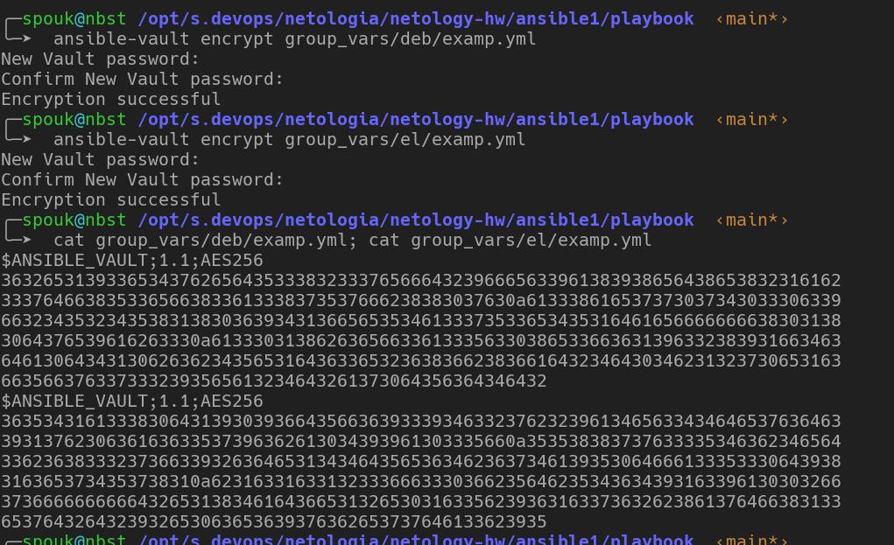
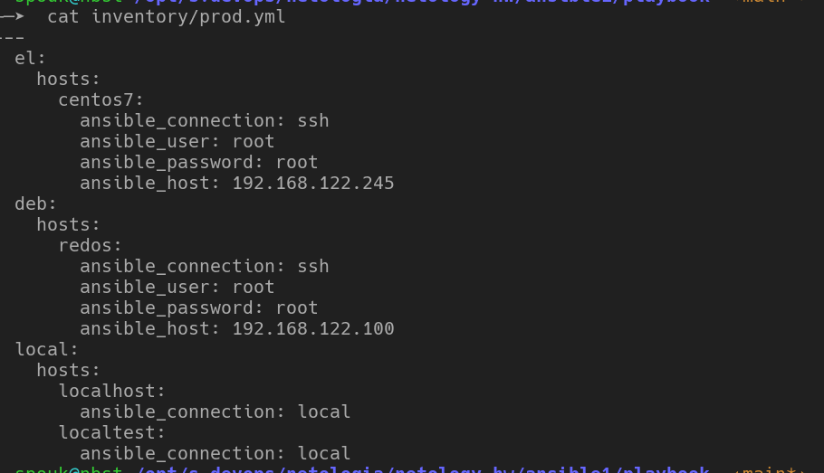
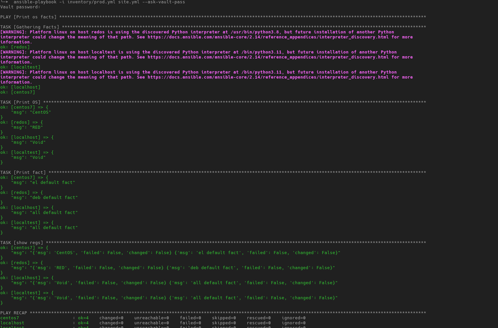
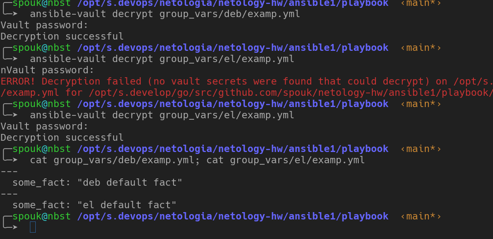
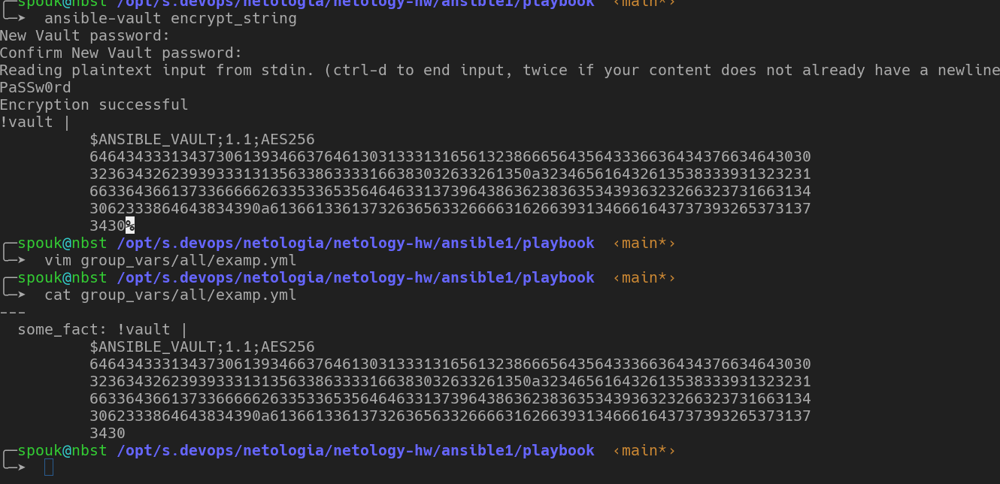

# Домашнее задание к занятию   1 «Введение в Ansible» - `Мартыненко Алексей`

## Подготовка к выполнению

> 1. Установите Ansible версии 2.10 или выше.
> 2. Создайте свой публичный репозиторий на GitHub с произвольным именем.
> 3. Скачайте [Playbook](./playbook/) из репозитория с домашним заданием и перенесите его в свой репозиторий.

## Основная часть

> 1. Попробуйте запустить playbook на окружении из `test.yml`, зафиксируйте значение, которое имеет факт `some_fact` для указанного хоста при выполнении playbook.
     

> 2. Найдите файл с переменными (group_vars), в котором задаётся найденное в первом пункте значение, и поменяйте его на `all default fact`.
     

> 3. Воспользуйтесь подготовленным (используется `docker`) или создайте собственное окружение для проведения дальнейших испытаний.
     

> 4. Проведите запуск playbook на окружении из `prod.yml`. Зафиксируйте полученные значения `some_fact` для каждого из `managed host`.
     

> 5. Добавьте факты в `group_vars` каждой из групп хостов так, чтобы для `some_fact` получились значения: для `deb` — `deb default fact`, для `el` — `el default fact`.
     

> 6.  Повторите запуск playbook на окружении `prod.yml`. Убедитесь, что выдаются корректные значения для всех хостов.
      

> 7. При помощи `ansible-vault` зашифруйте факты в `group_vars/deb` и `group_vars/el` с паролем `netology`.
     

> 8. Запустите playbook на окружении `prod.yml`. При запуске `ansible` должен запросить у вас пароль. Убедитесь в работоспособности.
     

> 9. Посмотрите при помощи `ansible-doc` список плагинов для подключения. Выберите подходящий для работы на `control node`.
     
    для решения задач я использовал плагины 
   `ansible.builtin.ssh` и `ansible.builtin.local` в соответствии с размещением `managed hosts`

> 10. В `prod.yml` добавьте новую группу хостов с именем  `local`, в ней разместите localhost с необходимым типом подключения.
      

> 11. Запустите playbook на окружении `prod.yml`. При запуске `ansible` должен запросить у вас пароль. Убедитесь, что факты `some_fact` для каждого из хостов определены из верных `group_vars`.
      

> 12. Заполните `README.md` ответами на вопросы. Сделайте `git push` в ветку `master`. В ответе отправьте ссылку на ваш открытый репозиторий с изменённым `playbook` и заполненным `README.md`.


## Необязательная часть

> 1. При помощи `ansible-vault` расшифруйте все зашифрованные файлы с переменными.
     

> 2. Зашифруйте отдельное значение `PaSSw0rd` для переменной `some_fact` паролем `netology`. Добавьте полученное значение в `group_vars/all/exmp.yml`.
     
    пересоздал, поправил

```shell
!vault |
          $ANSIBLE_VAULT;1.1;AES256
          65333233376138303633333639383861396237656262346237383335336230623162636538356237
          3263623661353561386539386463343362376664323034340a353762653732393732613439616436
          64653633333333653364383466666530336134646330633030373332346266626561346565363232
          6236386435623335320a623931346438636663373463333762653731393635643837663932386161
          6133
```

> 3.Запустите `playbook`, убедитесь, что для нужных хостов применился новый `fact`.


> 4. Добавьте новую группу хостов `fedora`, самостоятельно придумайте для неё переменную. В качестве образа можно использовать [этот вариант](https://hub.docker.com/r/pycontribs/fedora).
     

> 5. Напишите скрипт на bash: автоматизируйте поднятие необходимых контейнеров, запуск ansible-playbook и остановку контейнеров.

> 6. Все изменения должны быть зафиксированы и отправлены в ваш личный репозиторий.

---

### Как оформить решение задания

Выполненное домашнее задание пришлите в виде ссылки на .md-файл в вашем репозитории.

---

