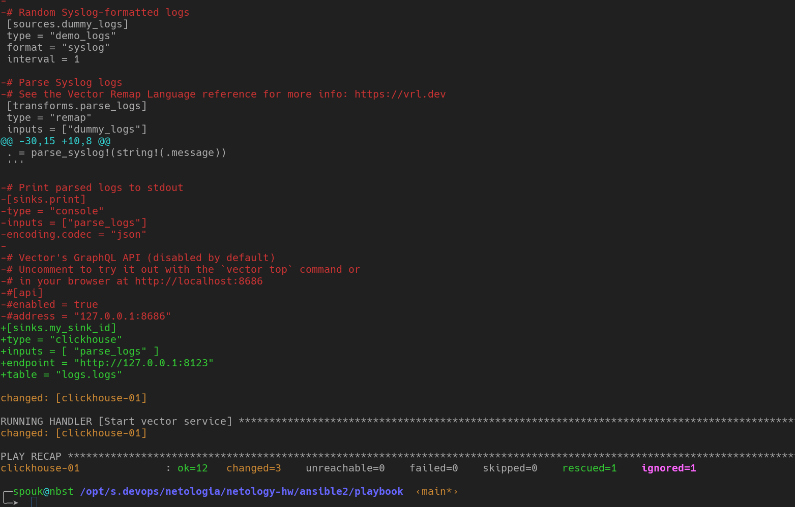
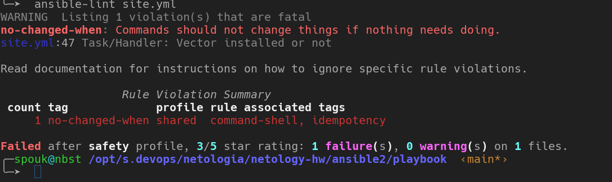
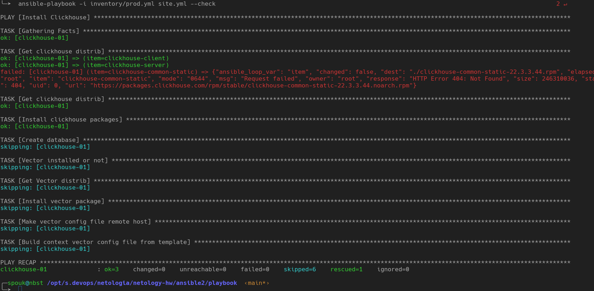
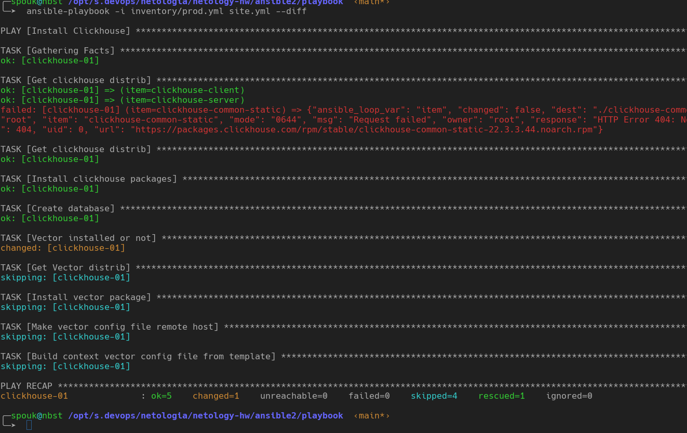
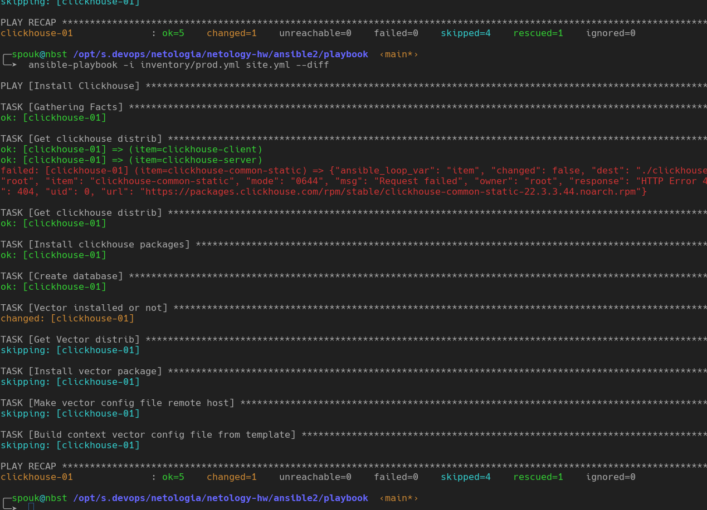

# Домашнее задание к занятию 2 «Работа с Playbook»

## Подготовка к выполнению

1. * Необязательно. Изучите, что такое [ClickHouse](https://www.youtube.com/watch?v=fjTNS2zkeBs) и [Vector](https://www.youtube.com/watch?v=CgEhyffisLY).
2. Создайте свой публичный репозиторий на GitHub с произвольным именем или используйте старый.
3. Скачайте [Playbook](./playbook/) из репозитория с домашним заданием и перенесите его в свой репозиторий.
4. Подготовьте хосты в соответствии с группами из предподготовленного playbook.

## Основная часть

> 1. Подготовьте свой inventory-файл `prod.yml`.
```yaml
---
clickhouse:
  hosts:
    clickhouse-01:
      ansible_host: 192.168.122.245
      ansible_connection: ssh
      ansible_user: root
      ansible_password: root
```
> 2. Допишите playbook: нужно сделать ещё один play, который устанавливает и настраивает [vector](https://vector.dev).
 + 
> 3. При создании tasks рекомендую использовать модули: `get_url`, `template`, `unarchive`, `file`.
 +
> 4. Tasks должны: скачать дистрибутив нужной версии, выполнить распаковку в выбранную директорию, установить vector.
     

> 5. Запустите `ansible-lint site.yml` и исправьте ошибки, если они есть.
     
     ```
     no-changed-when: Commands should not change things if nothing needs doing.
     site.yml:47 Task/Handler: Vector installed or not
     
     бессмысленный варниг, не улавливаю логику этой проверки
     ```
> 6. Попробуйте запустить playbook на этом окружении с флагом `--check`.
     
      
> 7. Запустите playbook на `prod.yml` окружении с флагом `--diff`. Убедитесь, что изменения на системе произведены.
     
     
> 8. Повторно запустите playbook с флагом `--diff` и убедитесь, что playbook идемпотентен.
     

> 9. Подготовьте README.md-файл по своему playbook. В нём должно быть описано: что делает playbook, какие у него есть параметры и теги.

10. Готовый playbook выложите в свой репозиторий, поставьте тег `08-ansible-02-playbook` на фиксирующий коммит, в ответ предоставьте ссылку на него.

---

### Как оформить решение задания

Выполненное домашнее задание пришлите в виде ссылки на .md-файл в вашем репозитории.

---
