# Домашнее задание к занятию 10 «Jenkins» Алексей Мартыненко

## Подготовка к выполнению

1. Создать два VM: для jenkins-master и jenkins-agent.
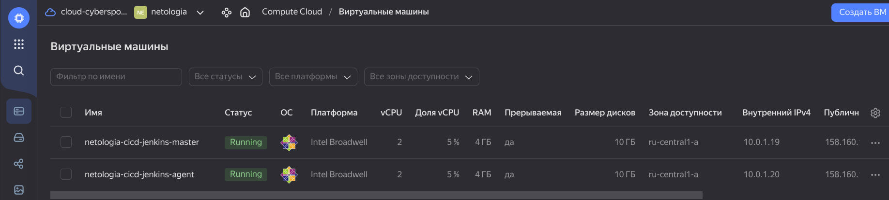
2. Установить Jenkins при помощи playbook.
   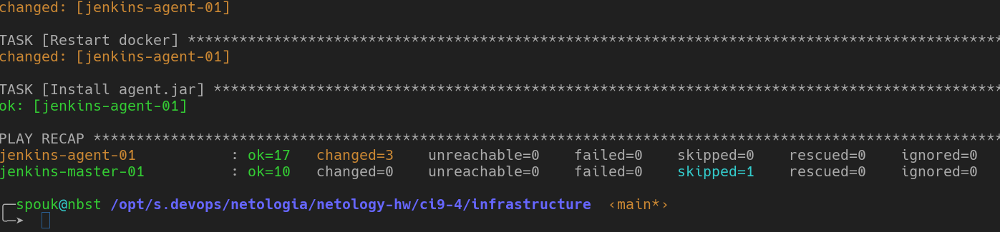
3. Запустить и проверить работоспособность.
4. Сделать первоначальную настройку.
   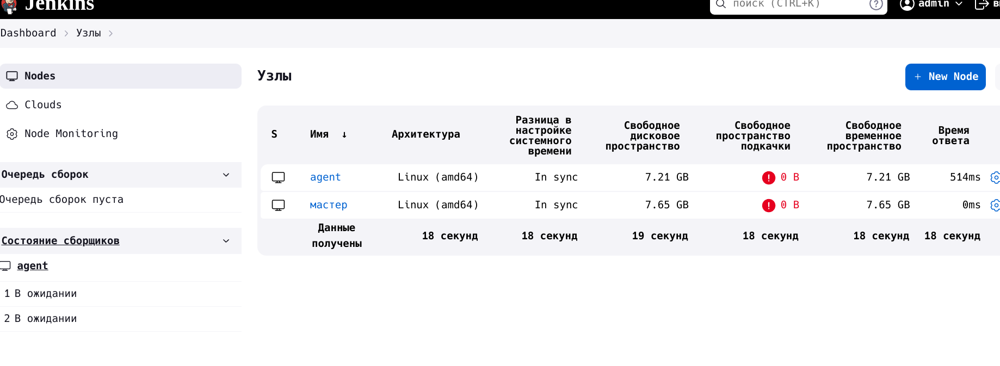


## Основная часть

1. Сделать Freestyle Job, который будет запускать `molecule test` из любого вашего репозитория с ролью.
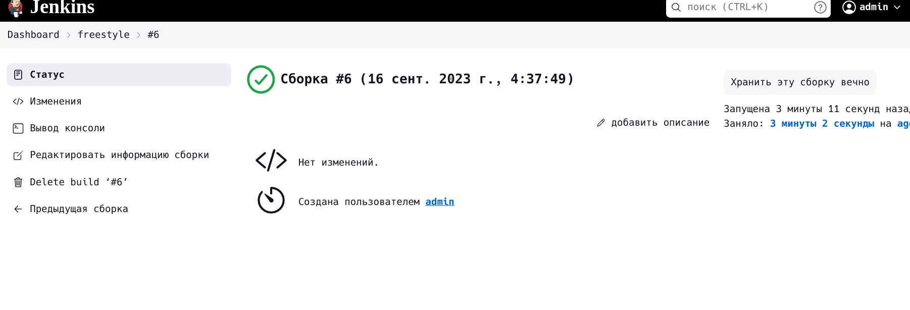

2. Сделать Declarative Pipeline Job, который будет запускать `molecule test` из любого вашего репозитория с ролью.
   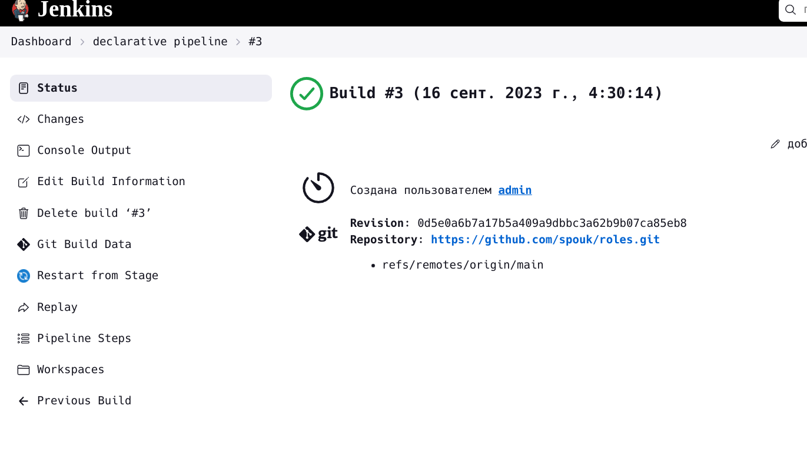
```shell
pipeline {
    agent {
        label 'agent'
    }
    stages {
        stage('clear work dir') {
            steps {
                deleteDir()
            }
        }
        stage('clone repo') {
            steps {
                git branch: 'main', url: 'https://github.com/spouk/roles.git'
            }
        }
        stage('run test') {
            steps {
                sh 'export PATH=$PATH:/usr/local/bin; pwd; ls -la; cd simplerole; molecule test'
            }
        }
    }
}
```
3. Перенести Declarative Pipeline в репозиторий в файл --> [`Jenkinsfile`](https://github.com/spouk/roles/blob/main/Jenkinksfile)

4. Создать Multibranch Pipeline на запуск `Jenkinsfile` из репозитория.
   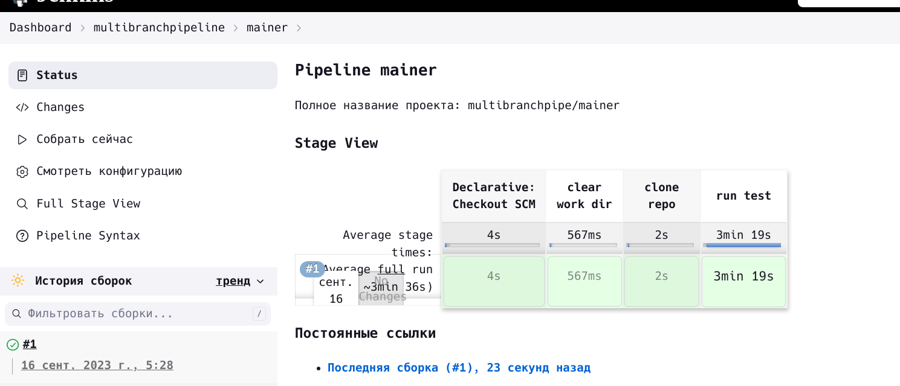
   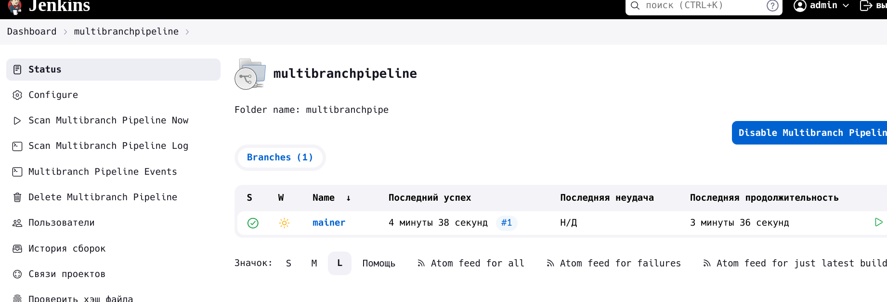

5. Создать Scripted Pipeline, наполнить его скриптом из [pipeline](./pipeline).
   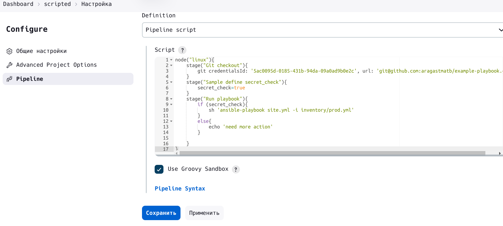

6. Внести необходимые изменения, чтобы Pipeline запускал `ansible-playbook` без флагов `--check --diff`, если не установлен параметр при запуске джобы (prod_run = True). По умолчанию параметр имеет значение False и запускает прогон с флагами `--check --diff`.
   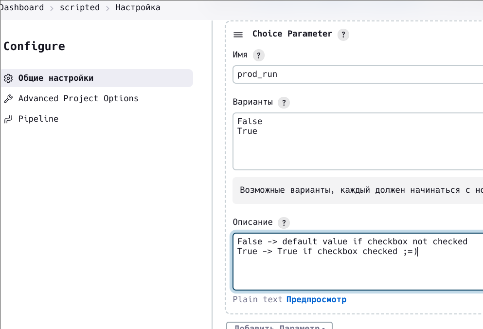
   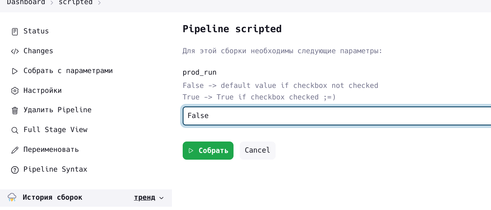
7. Проверить работоспособность, исправить ошибки, исправленный Pipeline вложить в репозиторий в файл `ScriptedJenkinsfile`.
   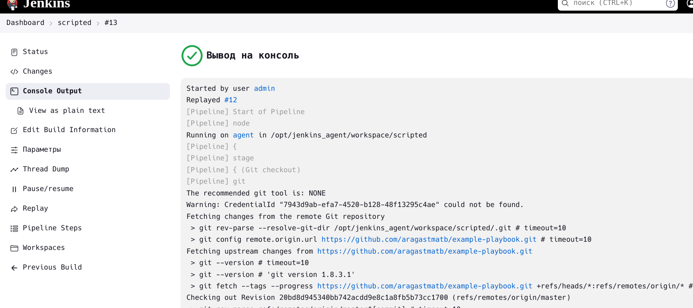

8. Отправить ссылку на репозиторий с ролью и Declarative Pipeline и Scripted Pipeline.
+ [`Scripted pipeline`](scriptedpipeline)
+ [`role`](https://github.com/spouk/roles.git) --> `simplerole`

## Необязательная часть

1. Создать скрипт на groovy, который будет собирать все Job, завершившиеся хотя бы раз неуспешно. Добавить скрипт в репозиторий с решением и названием `AllJobFailure.groovy`.
2. Создать Scripted Pipeline так, чтобы он мог сначала запустить через Yandex Cloud CLI необходимое количество инстансов, прописать их в инвентори плейбука и после этого запускать плейбук. Мы должны при нажатии кнопки получить готовую к использованию систему.

---

### Как оформить решение задания

Выполненное домашнее задание пришлите в виде ссылки на .md-файл в вашем репозитории.

---


