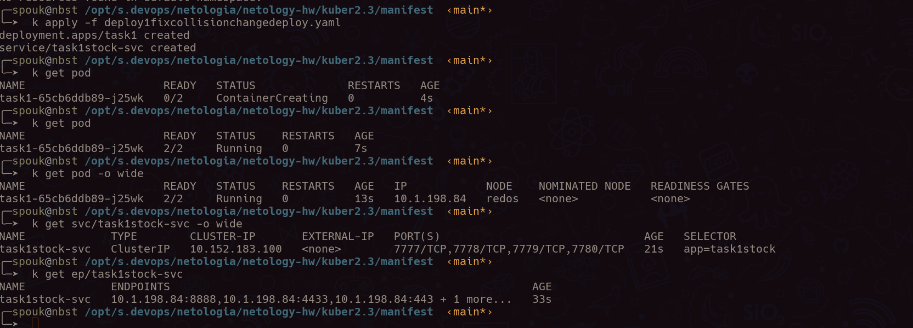
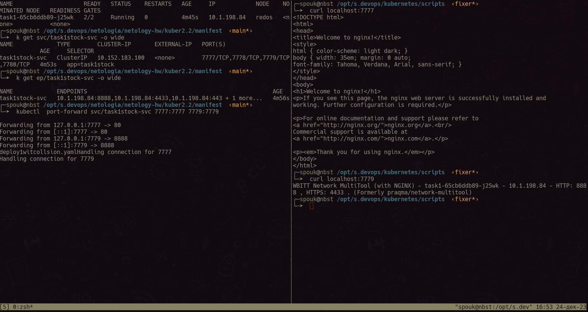
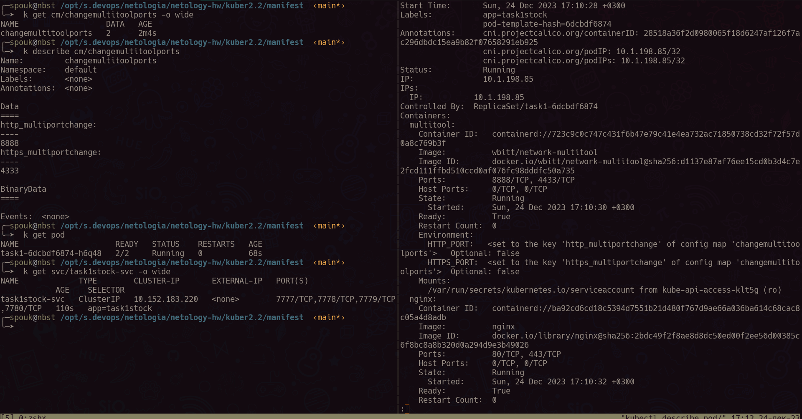
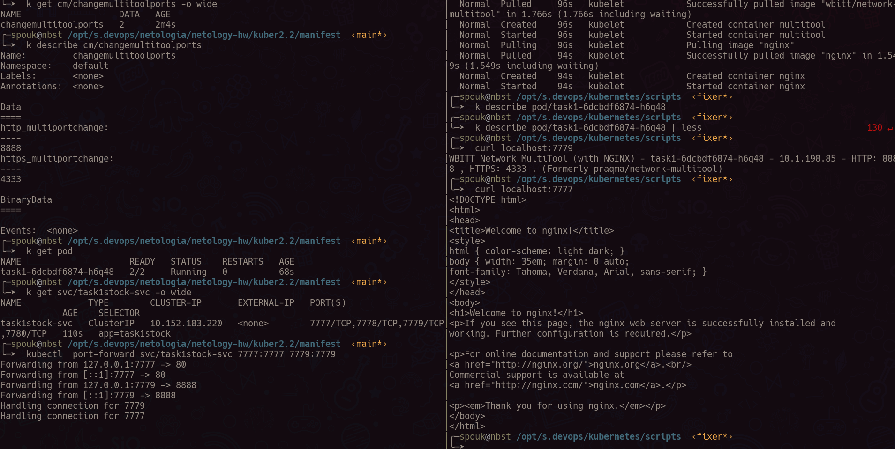
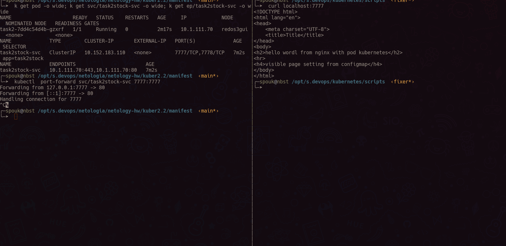
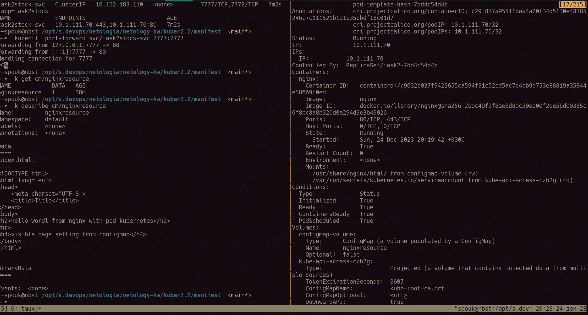
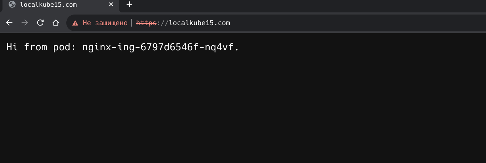

# Домашнее задание к занятию «Конфигурация приложений»

### Цель задания

В тестовой среде Kubernetes необходимо создать конфигурацию и продемонстрировать работу приложения.

------

### Чеклист готовности к домашнему заданию

1. Установленное K8s-решение (например, MicroK8s).
2. Установленный локальный kubectl.
3. Редактор YAML-файлов с подключённым GitHub-репозиторием.

------

### Инструменты и дополнительные материалы, которые пригодятся для выполнения задания

1. [Описание](https://kubernetes.io/docs/concepts/configuration/secret/) Secret.
2. [Описание](https://kubernetes.io/docs/concepts/configuration/configmap/) ConfigMap.
3. [Описание](https://github.com/wbitt/Network-MultiTool) Multitool.

------

### Задание 1. Создать Deployment приложения и решить возникшую проблему с помощью ConfigMap. Добавить веб-страницу

1. Создать Deployment приложения, состоящего из контейнеров nginx и multitool.
2. Решить возникшую проблему с помощью ConfigMap.
3. Продемонстрировать, что pod стартовал и оба конейнера работают.
4. Сделать простую веб-страницу и подключить её к Nginx с помощью ConfigMap. Подключить Service и показать вывод curl
   или в браузере.
5. Предоставить манифесты, а также скриншоты или вывод необходимых команд.

------

```json
#Warning: spec.template.spec.containers[1].ports[0]: duplicate port definition with spec.template.spec.containers[0].ports[0]
#Warning: spec.template.spec.containers[1].ports[1]: duplicate port definition with spec.template.spec.containers[0].ports[1]
```

при использовании этого [деплоя](manifest/deploy1witcollsion.yaml) получим варнинги в части коллизии по номерам
используемых портов в контейнерах, т.к. оба контейнера использует по дефолту 80,443 порты соответственно, однако у
мультитул заложенная возможность через переменные окружения смены дефолтных портов, это можно сделать через прямое
прописывание в манифесте деплоя нужных key:value [пример](manifest/deploy1fixcollisionchangedeploy.yaml) либо через configMap
[пример](manifest/deploy1fixconfigmap.yaml)






### Задание 2. Создать приложение с вашей веб-страницей, доступной по HTTPS

1. Создать Deployment приложения, состоящего из Nginx.
2. Создать собственную веб-страницу и подключить её как ConfigMap к приложению.
   
   
> --> [манифест](manifest/deploy2.yaml) <--
3. Выпустить самоподписной сертификат SSL. Создать Secret для использования сертификата.
4. Создать Ingress и необходимый Service, подключить к нему SSL в вид. Продемонстировать доступ к приложению по HTTPS.
   
   --> [манифест](manifest/experiments/dep.yaml) <--

------

### Правила приёма работы

1. Домашняя работа оформляется в своём GitHub-репозитории в файле README.md. Выполненное домашнее задание пришлите
   ссылкой на .md-файл в вашем репозитории.
2. Файл README.md должен содержать скриншоты вывода необходимых команд `kubectl`, а также скриншоты результатов.
3. Репозиторий должен содержать тексты манифестов или ссылки на них в файле README.md.

------
