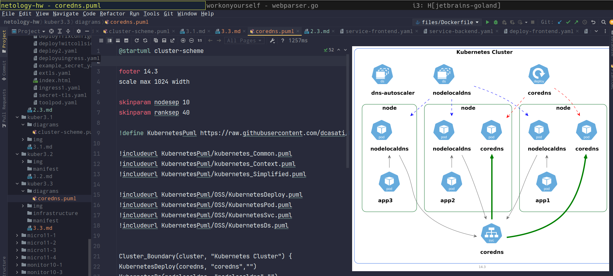
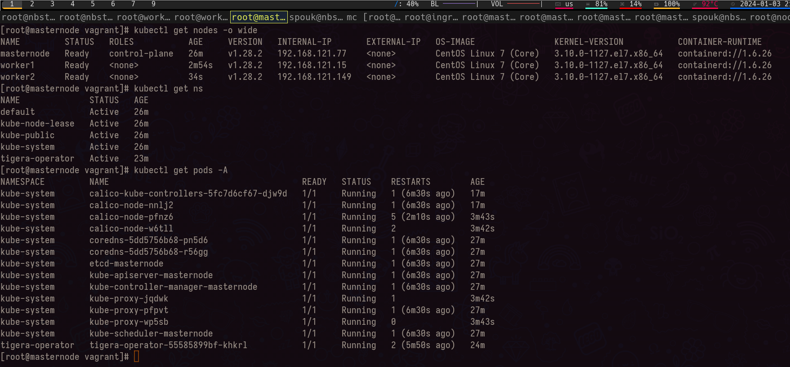
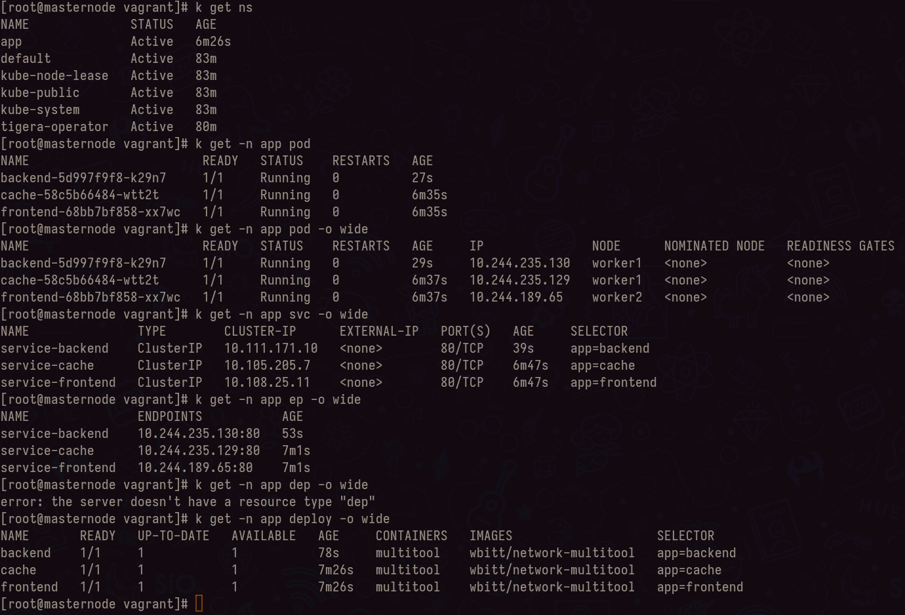
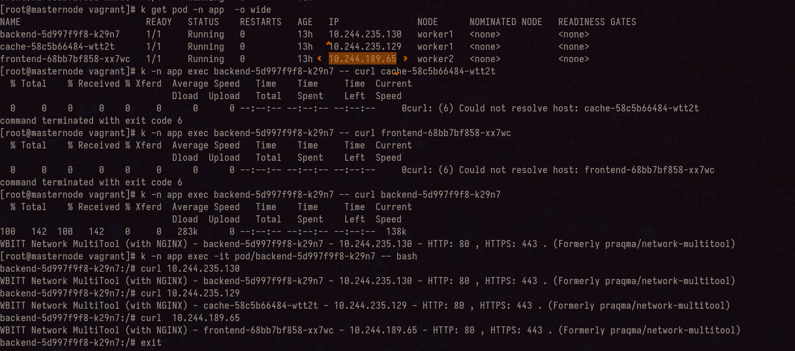
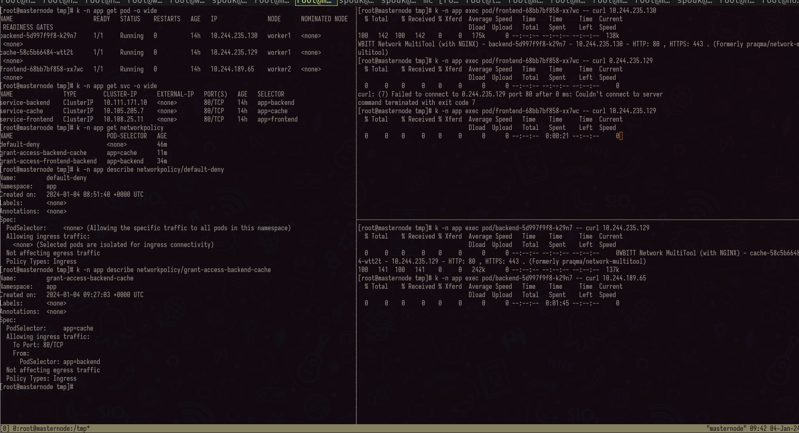

# Домашнее задание к занятию «Как работает сеть в K8s»

### Цель задания

Настроить сетевую политику доступа к подам.

### Чеклист готовности к домашнему заданию

1. Кластер K8s с установленным сетевым плагином Calico.

### Инструменты и дополнительные материалы, которые пригодятся для выполнения задания

1. [Документация Calico](https://www.tigera.io/project-calico/).
2. [Network Policy](https://kubernetes.io/docs/concepts/services-networking/network-policies/).
3. [About Network Policy](https://docs.projectcalico.org/about/about-network-policy).

-----

### Задание 1. Создать сетевую политику или несколько политик для обеспечения доступа

1. Создать deployment'ы приложений frontend, backend и cache и соответсвующие сервисы.
2. В качестве образа использовать network-multitool.
3. Разместить поды в namespace App.
4. Создать политики, чтобы обеспечить доступ frontend -> backend -> cache. Другие виды подключений должны быть запрещены.
5. Продемонстрировать, что трафик разрешён и запрещён.

- [x] развернут простой кластер с одной мастернодой и 2 воркернодами + CNI(calico) ([vagrantfile](infrastructure/Vagrantfile), [script-provisioning](infrastructure/script.sh))
- [x] развернуты 3 deployments, в ns App, согласно условиям постановки задачи
  - frontend --> [manifest frontend](manifest/frontend.yaml)
  - backend --> [manifest backend](manifest/backend.yaml)
  - cache --> [manifest cache](manifest/cache.yaml)
- [x] созданы политики, согласно которым обеспечены доступы --> [network politics](manifest/network-politics.yaml) 
  - frontend -> backend [np front->back](manifest/network-policy-backend.yaml)
  - backend -> cache [np back -> cache](manifest/network-policy-cache.yaml)
  - остальные виды подключений должны быть запрещены  [np deny all](manifest/network-policy-denyall.yaml)

### Правила приёма работы

1. Домашняя работа оформляется в своём Git-репозитории в файле README.md. Выполненное домашнее задание пришлите ссылкой на .md-файл в вашем репозитории.
2. Файл README.md должен содержать скриншоты вывода необходимых команд, а также скриншоты результатов.
3. Репозиторий должен содержать тексты манифестов или ссылки на них в файле README.md.
