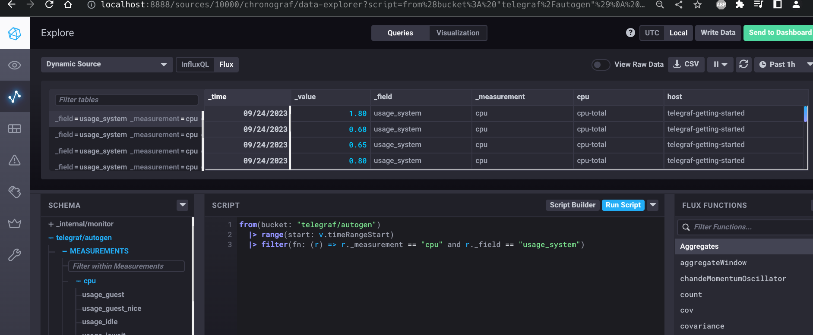
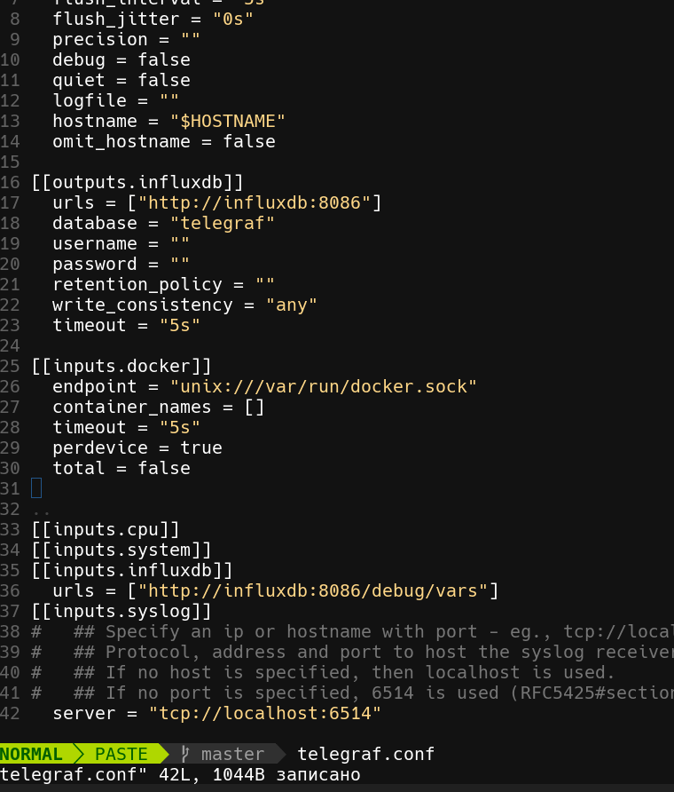
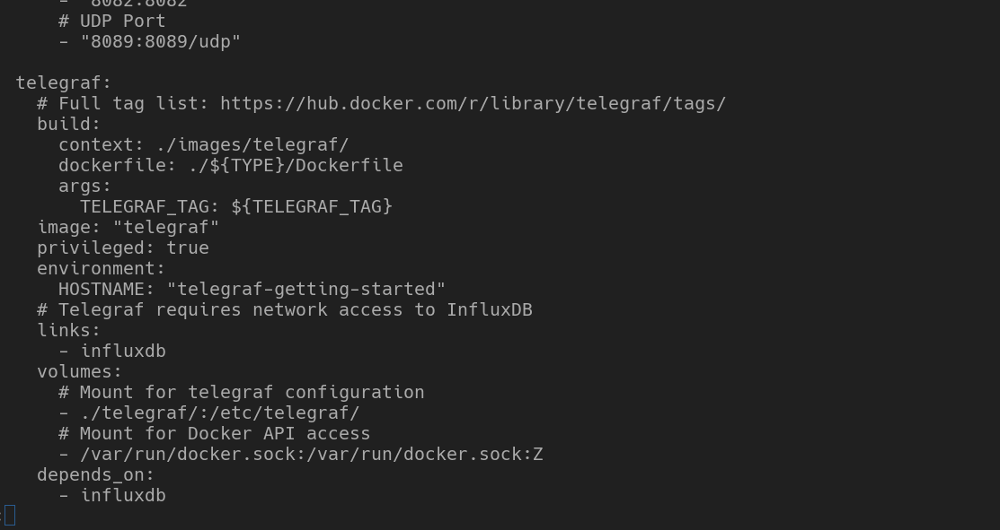

# Домашнее задание к занятию "13.Системы мониторинга"

## Обязательные задания

1. Вас пригласили настроить мониторинг на проект. На онбординге вам рассказали, что проект представляет из себя 
платформу для вычислений с выдачей текстовых отчетов, которые сохраняются на диск. Взаимодействие с платформой 
осуществляется по протоколу http. Также вам отметили, что вычисления загружают ЦПУ. Какой минимальный набор метрик вы
выведите в мониторинг и почему?

```yaml
+ количество http запросов, - позволит получить данные и математически рассчитать максимальный пулл подключений к системе без просадки производительности
+ количество http запросов получивших коды при выполнении 5**, 4** - позволит получить процент ошибок от общего количества запросов за отчетный период
+ время выполнения запроса к сервису по http - позволит провести корреляцию от количества запросов, количество ошибочных запросов,с привязкой к времени ответа, + эти же данные можно использовать при анализе IOPS + загрузка по ЦПУ при расчетах 
+ iops по дисковой системе  
+ степень загруженности системы по ЦПУ, можно использовать среднее значение за отчетный период времени LA
```

#
2. Менеджер продукта посмотрев на ваши метрики сказал, что ему непонятно что такое RAM/inodes/CPUla. Также он сказал, 
что хочет понимать, насколько мы выполняем свои обязанности перед клиентами и какое качество обслуживания. Что вы 
можете ему предложить?
```yaml
- разьяснить на пальцах, что это за метрики, и почему важен сбор статистики по ним
 (RAM - уровень загрузки оперативной памяти, inodes - количество свободных дескрипторов в ОС, доступных для использования, CPUla - среднее значение по загрузке ЦПУ(в целом) за конкретный период времени, к примеру за 15 минут)
- пояснить, что есть пиковые значения по этим метрикам, исходя из возможностей железа, и они известны (как правило), и есть текущие метрики, которые 
  при сравении показывают значения ниже среднего, что говорит и показывает клиентам, что качество обслуживания в части обеспечения 
  функционирования системы мы выполняем на 100%, и это подтверждают имеющиеся метрики по ключевым точкам
```

#
3. Вашей DevOps команде в этом году не выделили финансирование на построение системы сбора логов. Разработчики в свою 
очередь хотят видеть все ошибки, которые выдают их приложения. Какое решение вы можете предпринять в этой ситуации, 
чтобы разработчики получали ошибки приложения?

```yaml
развернуть ELK-стек, учитывая, что тулзы, входящие в состав стека opensource в базовой функциональности, то этого 
будет достаточно при полном отсутствии финансирования для сбора и анализа ошибок по работе приложений, при условии ,
что приложения логируют свою деятельность
```


#
4. Вы, как опытный SRE, сделали мониторинг, куда вывели отображения выполнения SLA=99% по http кодам ответов. 
Вычисляете этот параметр по следующей формуле: summ_2xx_requests/summ_all_requests. Данный параметр не поднимается выше 
70%, но при этом в вашей системе нет кодов ответа 5xx и 4xx. Где у вас ошибка?

```yaml
в формулу `summ_2xx_requests/summ_all_requests` учитываются только ответы с группы 2**, однако остальные группы ответов 
не принимаются во внимание, а это 1** и 3**
для полноты картины следует отдельно высчитывать процент ответов с этими группами кодов
`summ_3xx_requests+summ_1xx_requests/summ_all_requests`
```

#
5. Опишите основные плюсы и минусы pull и push систем мониторинга.
```yaml
push-модель, при которой инициатором передачи метрик серверной части, выступает агент
+ упрощенная репликация данных в разные системы мониторинга
+ наличие возможности адаптировать под корректный формат серверной части агента, также можно писать своих агентов, для аггрегации данных и передаче из через специализированный прокси (на примере pushgateway)
+ передача как правило происходит по протоколу udp, без подтверждения получения сервером данных, что снижает нагрузку на сетевую инфарструктуру

pull-модель, при которой инициатором для получения данных выступает серверная часть, в этом случае агенты работают в качестве пассивного элемента с , обеспечивающего форматирование и отдачу нужны значений метрик при запросе сервера
+ учитывая, что для получения данных требуется точное указание ip адресов , где размещены агенты, значительно увеличивается подлинность данных, получаемых от агентов
+ можно поднять и настроить единый прокси с поддержкой tsl, для создание защищенного канала при передаче метрик
+ упрощенная отладка выявления ошибок при передаче, учитывая способ получения метрик
```

#
6. Какие из ниже перечисленных систем относятся к push модели, а какие к pull? А может есть гибридные?

    - Prometheus (pull)
    - TICK (push)
    - Zabbix (push+pull)
    - VictoriaMetrics (push+pull)
    - Nagios (push)

#
7. Склонируйте себе [репозиторий](https://github.com/influxdata/sandbox/tree/master) и запустите TICK-стэк, 
используя технологии docker и docker-compose.

В виде решения на это упражнение приведите скриншот веб-интерфейса ПО chronograf (`http://localhost:8888`). 

P.S.: если при запуске некоторые контейнеры будут падать с ошибкой - проставьте им режим `Z`, например
`./data:/var/lib:Z`


#
8. Перейдите в веб-интерфейс Chronograf (http://localhost:8888) и откройте вкладку Data explorer.
        
    - Нажмите на кнопку Add a query
    - Изучите вывод интерфейса и выберите БД telegraf.autogen
    - В `measurments` выберите cpu->host->telegraf-getting-started, а в `fields` выберите usage_system. Внизу появится график утилизации cpu.
    - Вверху вы можете увидеть запрос, аналогичный SQL-синтаксису. Поэкспериментируйте с запросом, попробуйте изменить группировку и интервал наблюдений.

Для выполнения задания приведите скриншот с отображением метрик утилизации cpu из веб-интерфейса.


#
9. Изучите список [telegraf inputs](https://github.com/influxdata/telegraf/tree/master/plugins/inputs). 
Добавьте в конфигурацию telegraf следующий плагин - [docker](https://github.com/influxdata/telegraf/tree/master/plugins/inputs/docker):
```
[[inputs.docker]]
  endpoint = "unix:///var/run/docker.sock"
```



Дополнительно вам может потребоваться донастройка контейнера telegraf в `docker-compose.yml` дополнительного volume и 
режима privileged:
```
  telegraf:
    image: telegraf:1.4.0
    privileged: true
    volumes:
      - ./etc/telegraf.conf:/etc/telegraf/telegraf.conf:Z
      - /var/run/docker.sock:/var/run/docker.sock:Z
    links:
      - influxdb
    ports:
      - "8092:8092/udp"
      - "8094:8094"
      - "8125:8125/udp"
```

После настройке перезапустите telegraf, обновите веб интерфейс и приведите скриншотом список `measurments` в 
веб-интерфейсе базы telegraf.autogen . Там должны появиться метрики, связанные с docker.




плагин подключил, согласно [`документации`](https://github.com/influxdata/telegraf/tree/master/plugins/inputs/docker), 
добавил режим privileged, однако метрики по докеру не подтягиваются
попробовал развернуть на отдельной виртуалке - результат аналогичный  

Факультативно можете изучить какие метрики собирает telegraf после выполнения данного задания.


## Дополнительное задание (со звездочкой*) - необязательно к выполнению

1. Вы устроились на работу в стартап. На данный момент у вас нет возможности развернуть полноценную систему 
мониторинга, и вы решили самостоятельно написать простой python3-скрипт для сбора основных метрик сервера. Вы, как 
опытный системный-администратор, знаете, что системная информация сервера лежит в директории `/proc`. 
Также, вы знаете, что в системе Linux есть  планировщик задач cron, который может запускать задачи по расписанию.

Суммировав все, вы спроектировали приложение, которое:
- является python3 скриптом
- собирает метрики из папки `/proc`
- складывает метрики в файл 'YY-MM-DD-awesome-monitoring.log' в директорию /var/log 
(YY - год, MM - месяц, DD - день)
- каждый сбор метрик складывается в виде json-строки, в виде:
  + timestamp (временная метка, int, unixtimestamp)
  + metric_1 (метрика 1)
  + metric_2 (метрика 2)
  
     ...
     
  + metric_N (метрика N)
  
- сбор метрик происходит каждую 1 минуту по cron-расписанию

Для успешного выполнения задания нужно привести:

а) работающий код python3-скрипта,

б) конфигурацию cron-расписания,

в) пример верно сформированного 'YY-MM-DD-awesome-monitoring.log', имеющий не менее 5 записей,

P.S.: количество собираемых метрик должно быть не менее 4-х.
P.P.S.: по желанию можно себя не ограничивать только сбором метрик из `/proc`.

2. В веб-интерфейсе откройте вкладку `Dashboards`. Попробуйте создать свой dashboard с отображением:

    - утилизации ЦПУ
    - количества использованного RAM
    - утилизации пространства на дисках
    - количество поднятых контейнеров
    - аптайм
    - ...
    - фантазируйте)
    
    ---

### Как оформить ДЗ?

Выполненное домашнее задание пришлите ссылкой на .md-файл в вашем репозитории.

---

