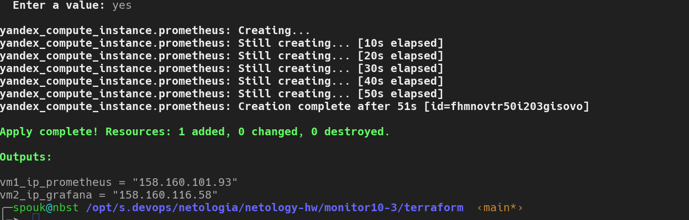
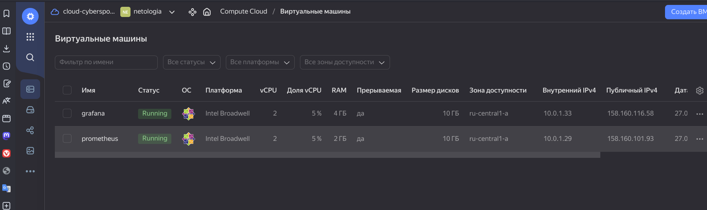
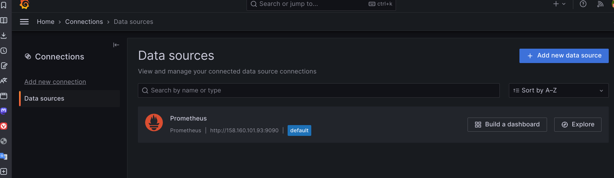
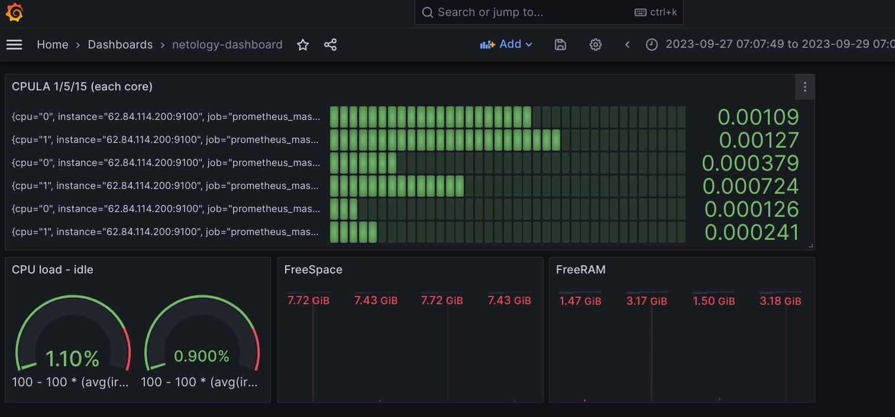
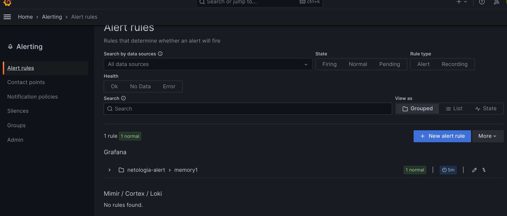
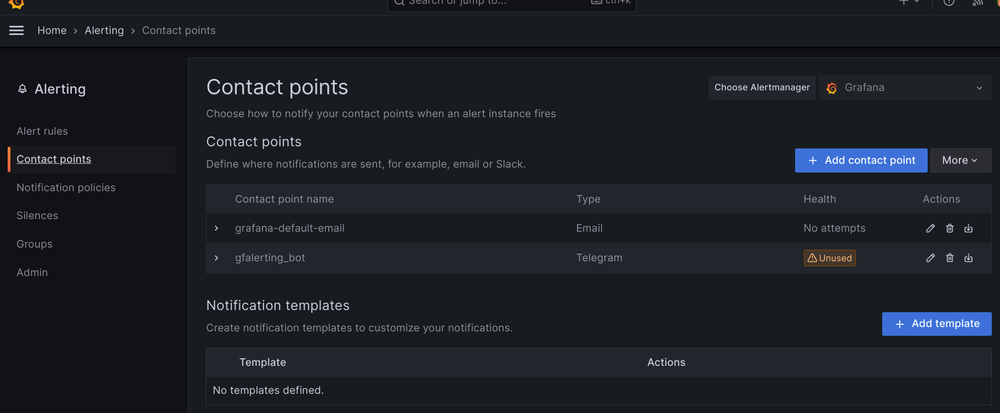
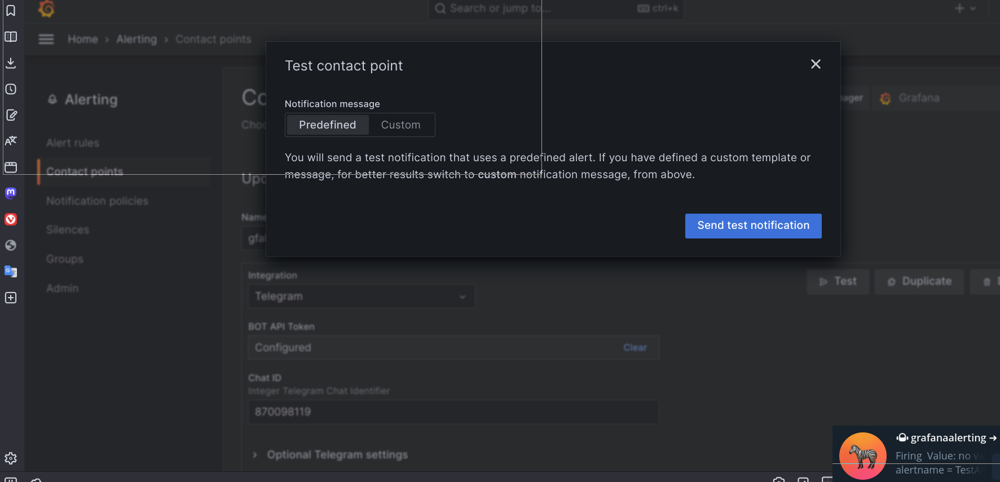

# Домашнее задание к занятию 14 «Средство визуализации Grafana»

## Задание повышенной сложности

**При решении задания 1** не используйте директорию [help](./help) для сборки проекта. 
Самостоятельно разверните grafana, где в роли источника данных будет выступать prometheus, 
а сборщиком данных будет node-exporter:

- grafana;
- prometheus-server;
- prometheus node-exporter.

За дополнительными материалами можете обратиться в официальную документацию grafana и prometheus.

В решении к домашнему заданию также приведите все конфигурации, скрипты, манифесты, которые вы 
использовали в процессе решения задания.




```yaml
развернуты с помощью terraform 2 виртуальные машины, на одной развернут на "железке" сервер prometheus 
на другой с помощью контейнеризации поднята grafana. Развертывание prometheus && grafana осуществлялось с помощью
ansible. В качестве источника данных испоьзуется прометеус.
```

**При решении задания 3** вы должны самостоятельно завести удобный для вас канал нотификации, например, Telegram или email, и отправить туда тестовые события.

В решении приведите скриншоты тестовых событий из каналов нотификаций.

## Обязательные задания

### Задание 1

1. Используя директорию [help](./help) внутри этого домашнего задания, запустите связку prometheus-grafana.
1. Зайдите в веб-интерфейс grafana, используя авторизационные данные, указанные в манифесте docker-compose.
1. Подключите поднятый вами prometheus, как источник данных.
1. Решение домашнего задания — скриншот веб-интерфейса grafana со списком подключенных Datasource.

при решении директория с вложениями [`help`](./help) не использовалась



## Задание 2

Изучите самостоятельно ресурсы:

1. [PromQL tutorial for beginners and humans](https://valyala.medium.com/promql-tutorial-for-beginners-9ab455142085).
1. [Understanding Machine CPU usage](https://www.robustperception.io/understanding-machine-cpu-usage).
1. [Introduction to PromQL, the Prometheus query language](https://grafana.com/blog/2020/02/04/introduction-to-promql-the-prometheus-query-language/).

Создайте Dashboard и в ней создайте Panels:

- утилизация CPU для nodeexporter (в процентах, 100-idle);
- CPULA 1/5/15;
- количество свободной оперативной памяти;
- количество места на файловой системе.

Для решения этого задания приведите promql-запросы для выдачи этих метрик, а также скриншот получившейся Dashboard.



```yaml
CPUUSAGE - IDLE
--
100 - 100 * (avg(irate(node_cpu_seconds_total{mode="idle", job="prometheus_master", instance="62.84.114.200:9100"}[1m])))
100 - 100 * (avg(irate(node_cpu_seconds_total{mode="idle", job="prometheus_master", instance="158.160.97.32:9100"}[1m])))

FREESPACE
--
node_filesystem_avail_bytes{mountpoint="/",fstype!="rootfs"}

FREERAM
--
node_memory_MemAvailable_bytes{job="prometheus_master"}

CPULOAD 1/5/15
--
rate(node_cpu_seconds_total{job="prometheus_master", mode="system", instance="62.84.114.200:9100"}[1m])
rate(node_cpu_seconds_total{job="prometheus_master", mode="system", instance="62.84.114.200:9100"}[5m])
rate(node_cpu_seconds_total{job="prometheus_master", mode="system", instance="62.84.114.200:9100"}[15m])

```

## Задание 3

1. Создайте для каждой Dashboard подходящее правило alert — можно обратиться к первой лекции в блоке «Мониторинг».
1. В качестве решения задания приведите скриншот вашей итоговой Dashboard.




в версии Ынтырпрайз grafana сердечки не появляются, там есть опции для добавления правил для дашборда с прописыванием
выборки значений на promql и сравнении этих значений с условиями

## Задание 4

1. Сохраните ваш Dashboard.Для этого перейдите в настройки Dashboard, выберите в боковом меню «JSON MODEL». Далее скопируйте отображаемое json-содержимое в отдельный файл и сохраните его.
1. В качестве решения задания приведите листинг этого файла.

итого
=
```json
{
  "annotations": {
    "list": [
      {
        "builtIn": 1,
        "datasource": {
          "type": "grafana",
          "uid": "-- Grafana --"
        },
        "enable": true,
        "hide": true,
        "iconColor": "rgba(0, 211, 255, 1)",
        "name": "Annotations & Alerts",
        "type": "dashboard"
      }
    ]
  },
  "editable": true,
  "fiscalYearStartMonth": 0,
  "graphTooltip": 0,
  "id": 4,
  "links": [],
  "liveNow": false,
  "panels": [
    {
      "datasource": {
        "type": "prometheus",
        "uid": "ff65ef68-eecb-4aed-9d8e-2c675b0083df"
      },
      "description": "",
      "fieldConfig": {
        "defaults": {
          "color": {
            "mode": "thresholds"
          },
          "mappings": [],
          "thresholds": {
            "mode": "absolute",
            "steps": [
              {
                "color": "green",
                "value": null
              },
              {
                "color": "red",
                "value": 80
              }
            ]
          }
        },
        "overrides": []
      },
      "gridPos": {
        "h": 6,
        "w": 18,
        "x": 0,
        "y": 0
      },
      "id": 4,
      "options": {
        "displayMode": "lcd",
        "minVizHeight": 10,
        "minVizWidth": 0,
        "orientation": "horizontal",
        "reduceOptions": {
          "calcs": [
            "lastNotNull"
          ],
          "fields": "",
          "values": false
        },
        "showUnfilled": true,
        "valueMode": "color"
      },
      "pluginVersion": "10.1.2",
      "targets": [
        {
          "datasource": {
            "type": "prometheus",
            "uid": "ff65ef68-eecb-4aed-9d8e-2c675b0083df"
          },
          "disableTextWrap": false,
          "editorMode": "code",
          "expr": "rate(node_cpu_seconds_total{job=\"prometheus_master\", mode=\"system\", instance=\"62.84.114.200:9100\"}[1m]) ",
          "fullMetaSearch": false,
          "includeNullMetadata": false,
          "instant": false,
          "legendFormat": "__auto",
          "range": true,
          "refId": "A",
          "useBackend": false
        },
        {
          "datasource": {
            "type": "prometheus",
            "uid": "ff65ef68-eecb-4aed-9d8e-2c675b0083df"
          },
          "editorMode": "code",
          "expr": "rate(node_cpu_seconds_total{job=\"prometheus_master\", mode=\"system\", instance=\"62.84.114.200:9100\"}[5m]) ",
          "hide": false,
          "instant": false,
          "legendFormat": "__auto",
          "range": true,
          "refId": "B"
        },
        {
          "datasource": {
            "type": "prometheus",
            "uid": "ff65ef68-eecb-4aed-9d8e-2c675b0083df"
          },
          "editorMode": "code",
          "expr": "rate(node_cpu_seconds_total{job=\"prometheus_master\", mode=\"system\", instance=\"62.84.114.200:9100\"}[15m]) ",
          "hide": false,
          "instant": false,
          "legendFormat": "__auto",
          "range": true,
          "refId": "C"
        }
      ],
      "title": "CPULA 1/5/15 (each core)",
      "type": "bargauge"
    },
    {
      "datasource": {
        "type": "prometheus",
        "uid": "ff65ef68-eecb-4aed-9d8e-2c675b0083df"
      },
      "fieldConfig": {
        "defaults": {
          "color": {
            "mode": "thresholds"
          },
          "mappings": [],
          "thresholds": {
            "mode": "absolute",
            "steps": [
              {
                "color": "green",
                "value": null
              },
              {
                "color": "red",
                "value": 80
              }
            ]
          },
          "unit": "percent"
        },
        "overrides": []
      },
      "gridPos": {
        "h": 5,
        "w": 6,
        "x": 0,
        "y": 6
      },
      "id": 3,
      "options": {
        "orientation": "auto",
        "reduceOptions": {
          "calcs": [
            "lastNotNull"
          ],
          "fields": "",
          "values": false
        },
        "showThresholdLabels": false,
        "showThresholdMarkers": true
      },
      "pluginVersion": "10.1.2",
      "targets": [
        {
          "datasource": {
            "type": "prometheus",
            "uid": "ff65ef68-eecb-4aed-9d8e-2c675b0083df"
          },
          "disableTextWrap": false,
          "editorMode": "code",
          "expr": "100 - 100 * (avg(irate(node_cpu_seconds_total{mode=\"idle\", job=\"prometheus_master\", instance=\"62.84.114.200:9100\"}[1m])))",
          "fullMetaSearch": false,
          "includeNullMetadata": true,
          "instant": false,
          "legendFormat": "__auto",
          "range": true,
          "refId": "A",
          "useBackend": false
        },
        {
          "datasource": {
            "type": "prometheus",
            "uid": "ff65ef68-eecb-4aed-9d8e-2c675b0083df"
          },
          "editorMode": "code",
          "expr": "100 - 100 * (avg(irate(node_cpu_seconds_total{mode=\"idle\", job=\"prometheus_master\", instance=\"158.160.97.32:9100\"}[1m])))",
          "hide": false,
          "instant": false,
          "legendFormat": "__auto",
          "range": true,
          "refId": "B"
        }
      ],
      "title": "CPU load - idle",
      "type": "gauge"
    },
    {
      "datasource": {
        "type": "prometheus",
        "uid": "ff65ef68-eecb-4aed-9d8e-2c675b0083df"
      },
      "fieldConfig": {
        "defaults": {
          "color": {
            "mode": "thresholds"
          },
          "mappings": [],
          "thresholds": {
            "mode": "absolute",
            "steps": [
              {
                "color": "green",
                "value": null
              },
              {
                "color": "red",
                "value": 80
              }
            ]
          },
          "unit": "bytes"
        },
        "overrides": []
      },
      "gridPos": {
        "h": 5,
        "w": 6,
        "x": 6,
        "y": 6
      },
      "id": 2,
      "options": {
        "colorMode": "value",
        "graphMode": "area",
        "justifyMode": "auto",
        "orientation": "auto",
        "reduceOptions": {
          "calcs": [
            "lastNotNull"
          ],
          "fields": "",
          "values": false
        },
        "textMode": "auto"
      },
      "pluginVersion": "10.1.2",
      "targets": [
        {
          "datasource": {
            "type": "prometheus",
            "uid": "ff65ef68-eecb-4aed-9d8e-2c675b0083df"
          },
          "editorMode": "code",
          "expr": "node_filesystem_avail_bytes{mountpoint=\"/\",fstype!=\"rootfs\"}",
          "instant": false,
          "legendFormat": "__auto",
          "range": true,
          "refId": "A"
        }
      ],
      "title": "FreeSpace",
      "type": "stat"
    },
    {
      "datasource": {
        "type": "prometheus",
        "uid": "ff65ef68-eecb-4aed-9d8e-2c675b0083df"
      },
      "description": "",
      "fieldConfig": {
        "defaults": {
          "color": {
            "mode": "thresholds"
          },
          "mappings": [],
          "thresholds": {
            "mode": "absolute",
            "steps": [
              {
                "color": "green",
                "value": null
              },
              {
                "color": "red",
                "value": 80
              }
            ]
          },
          "unit": "bytes"
        },
        "overrides": []
      },
      "gridPos": {
        "h": 5,
        "w": 6,
        "x": 12,
        "y": 6
      },
      "id": 1,
      "options": {
        "colorMode": "value",
        "graphMode": "area",
        "justifyMode": "auto",
        "orientation": "auto",
        "reduceOptions": {
          "calcs": [
            "lastNotNull"
          ],
          "fields": "",
          "values": false
        },
        "textMode": "auto"
      },
      "pluginVersion": "10.1.2",
      "targets": [
        {
          "datasource": {
            "type": "prometheus",
            "uid": "ff65ef68-eecb-4aed-9d8e-2c675b0083df"
          },
          "disableTextWrap": false,
          "editorMode": "code",
          "expr": "node_memory_MemAvailable_bytes{job=\"prometheus_master\"}",
          "fullMetaSearch": false,
          "includeNullMetadata": true,
          "instant": false,
          "legendFormat": "__auto",
          "range": true,
          "refId": "A",
          "useBackend": false
        }
      ],
      "title": "FreeRAM",
      "type": "stat"
    }
  ],
  "refresh": "",
  "schemaVersion": 38,
  "style": "dark",
  "tags": [],
  "templating": {
    "list": []
  },
  "time": {
    "from": "now-6h",
    "to": "now"
  },
  "timepicker": {},
  "timezone": "",
  "title": "netology-dashboard",
  "uid": "a10eab7e-60da-4d6f-b5ae-5432363859b3",
  "version": 6,
  "weekStart": ""
}
```
---

### Как оформить решение задания

Выполненное домашнее задание пришлите в виде ссылки на .md-файл в вашем репозитории.

---
