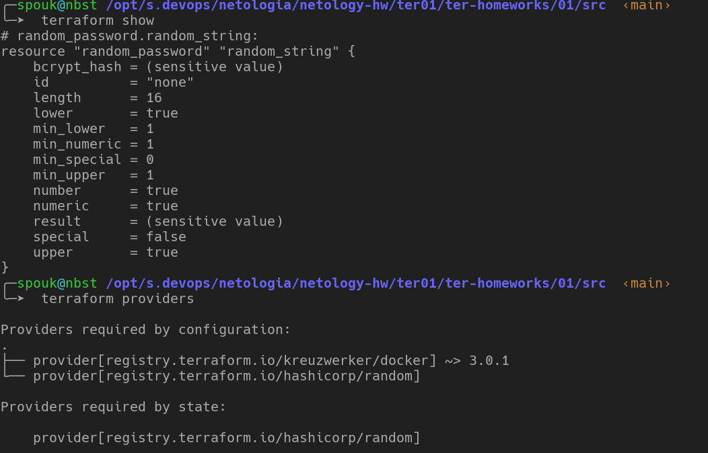

# Домашнее задание к занятию   «Введение в Terraform» - `Мартыненко Алексей`


### Задание 1

1. Перейдите в каталог src. Скачайте все необходимые зависимости, использованные в проекте.
   

2. Изучите файл .gitignore. В каком terraform файле согласно этому .gitignore допустимо сохранить личную, секретную информацию?
```shell
personal.auto.tfvars
```
3. Выполните код проекта. Найдите в State-файле секретное содержимое созданного ресурса random_password. Пришлите его в качестве ответа. 
```shell
 ╰─➤  cat terraform.tfstate                                                                                                                               130 ↵
{
  "version": 4,
  "terraform_version": "1.4.6",
  "serial": 3,
  "lineage": "fefc5a57-157a-6535-7c29-be5a189259a8",
  "outputs": {},
  "resources": [
    {
      "mode": "managed",
      "type": "local_file",
      "name": "savepassword",
      "provider": "provider[\"registry.terraform.io/hashicorp/local\"]",
      "instances": [
        {
          "schema_version": 0,
          "attributes": {
            "content": "6IYJL4oq0xL1nB6C",
            "content_base64": null,
            "content_base64sha256": "NlaAj7ZGb1HIXkGphwAgI/tUaeBMrHTIdI79p9f+cgs=",
            "content_base64sha512": "qvUybu98jWB7cev9R9U64s/IPw6kZJhBETGJ1gAZrJd9vXPyReAX/eZoGrW2Ws+J7hxYBm/aScdDfgq/RLEwIg==",
            "content_md5": "0eb9748152e78d72213722eb87f8a9ac",
            "content_sha1": "8fb22df90b67eaa414e2b8979c7b60204ba41130",
            "content_sha256": "3656808fb6466f51c85e41a987002023fb5469e04cac74c8748efda7d7fe720b",
            "content_sha512": "aaf5326eef7c8d607b71ebfd47d53ae2cfc83f0ea4649841113189d60019ac977dbd73f245e017fde6681ab5b65acf89ee1c58066fda49c7437e0abf44b13022",
            "directory_permission": "0777",
            "file_permission": "0777",
            "filename": "/tmp/passwordfile",
            "id": "8fb22df90b67eaa414e2b8979c7b60204ba41130",
            "sensitive_content": null,
            "source": null
          },
          "sensitive_attributes": [
            [
              {
                "type": "get_attr",
                "value": "content"
              }
            ]
          ],
          "dependencies": [
            "random_password.random_string"
          ]
        }
      ]
    },
    {
      "mode": "managed",
      "type": "random_password",
      "name": "random_string",
      "provider": "provider[\"registry.terraform.io/hashicorp/random\"]",
      "instances": [
        {
          "schema_version": 3,
          "attributes": {
            "bcrypt_hash": "$2a$10$bHZJPS.zkCwmEr4fjzzNZOo7UKTtC9jjBSWEqZZaNU8Wc4B0eTPJC",
            "id": "none",
            "keepers": null,
            "length": 16,
            "lower": true,
            "min_lower": 1,
            "min_numeric": 1,
            "min_special": 0,
            "min_upper": 1,
            "number": true,
            "numeric": true,
            "override_special": null,
            "result": "6IYJL4oq0xL1nB6C",
            "special": false,
            "upper": true
          },
          "sensitive_attributes": []
        }
      ]
    }
  ],
  "check_results": null
}
```
4. Раскомментируйте блок кода, примерно расположенный на строчках 29-42 файла main.tf. Выполните команду terraform validate. Объясните в чем заключаются намеренно допущенные ошибки? Исправьте их.
```shell
╷
│ Error: Missing name for resource
│
│   on main.tf line 27, in resource "docker_image":
│   27: resource "docker_image" {
│
│ All resource blocks must have 2 labels (type, name).
╵
 >> нарушен шаблон построения ресурса, для корректного формирования ресурса требуется 2 "аргумента" = тип и  имя 
╷
│ Error: Invalid resource name
│
│   on main.tf line 32, in resource "docker_container" "1nginx":
│   32: resource "docker_container" "1nginx" {
│
│ A name must start with a letter or underscore and may contain only letters, digits, underscores, and dashes.

>>  имя ресурса не может начинаться _с числового значения_, в данном случае имя начинается  с 1 (единицы) что вызывает недовольство интерпретатора

```
5. Выполните код. В качестве ответа приложите вывод команды docker ps
```shell
╭─spouk@nbst /opt/s.devops/netologia/netology-hw/ter01/ter-homeworks/01/src  ‹main*›
╰─➤  docker ps
CONTAINER ID   IMAGE                    COMMAND                  CREATED          STATUS          PORTS                                       NAMES
b9ff38ebd6c1   448a08f1d2f9             "/docker-entrypoint.…"   33 seconds ago   Up 32 seconds   0.0.0.0:8000->80/tcp                        example_6IYJL4oq0xL1nB6C
56cf7be58140   grafana/grafana          "/run.sh"                23 hours ago     Up 23 hours     0.0.0.0:3000->3000/tcp, :::3000->3000/tcp   grafana
e31369acd03b   prom/prometheus:latest   "/bin/prometheus --s…"   23 hours ago     Up 23 hours     0.0.0.0:9090->9090/tcp, :::9090->9090/tcp   prometheus
591fa6e16abb   prom/node-exporter       "/bin/node_exporter"     23 hours ago     Up 23 hours     0.0.0.0:9100->9100/tcp, :::9100->9100/tcp   prometheus_exporter
```
6. Замените имя docker-контейнера в блоке кода на hello_world, выполните команду terraform apply -auto-approve. Объясните своими словами, в чем может быть опасность применения ключа -auto-approve ?
   при использовании флага `auto-approve` terraform  не спрашивает подтверждения вносимых изменений у пользователя, а применяет их "как есть" что чревато нарушением работоспобности инфраструктуры из-за допущенной случайно опечатки-ошибки в плане + затирается старый план
7. Уничтожьте созданные ресурсы с помощью terraform. Убедитесь, что все ресурсы удалены. Приложите содержимое файла terraform.tfstate.
```shell
╭─spouk@nbst /opt/s.devops/netologia/netology-hw/ter01/ter-homeworks/01/src  ‹main*›
╰─➤  cat terraform.tfstate
{
  "version": 4,
  "terraform_version": "1.4.6",
  "serial": 16,
  "lineage": "fefc5a57-157a-6535-7c29-be5a189259a8",
  "outputs": {},
  "resources": [],
  "check_results": null
}
```
8. Объясните, почему при этом не был удален docker образ nginx:latest ?(Ответ найдите в коде проекта или документации)
   причиной служит выставленная опция ресурса - keep_locally = true, которая,при выставленном булевом значении - true, запрещает terraform удаление образа при очистке ресурсов

### Дополнительные задания (со звездочкой*)
Настоятельно рекомендуем выполнять все задания под звёздочкой. Их выполнение поможет глубже разобраться в материале.
Задания под звёздочкой дополнительные (необязательные к выполнению) и никак не повлияют на получение вами зачета по этому домашнему заданию.

### Задание 2*
1. Изучите в документации provider Virtualbox от shekeriev.
2. Создайте с его помощью любую виртуальную машину. Чтобы не использовать VPN советуем выбрать любой образ с расположением в github из списка

В качестве ответа приложите plan для создаваемого ресурса и скриншот созданного в VB ресурса.

```shell
╰─➤  terraform plan

Terraform used the selected providers to generate the following execution plan. Resource actions are indicated with the following symbols:
  + create

Terraform will perform the following actions:

  # virtualbox_vm.node will be created
  + resource "virtualbox_vm" "node" {
      + cpus   = 2
      + id     = (known after apply)
      + image  = "centos-6.3-chef-10.14.2.box"
      + memory = "512 mib"
      + name   = "centos63"
      + status = "running"
    }

Plan: 1 to add, 0 to change, 0 to destroy.
```

при попытке создать образ выходит ошибка 
```shell
2023-05-17T15:08:41.139+0300 [TRACE] statemgr.Filesystem: state has changed since last snapshot, so incrementing serial to 12
2023-05-17T15:08:41.139+0300 [TRACE] statemgr.Filesystem: writing snapshot at terraform.tfstate
2023-05-17T15:08:41.139+0300 [ERROR] vertex "virtualbox_vm.node" error: can't create virtualbox VM centos63: exit status 1
2023-05-17T15:08:41.139+0300 [TRACE] vertex "virtualbox_vm.node": visit complete, with errors
2023-05-17T15:08:41.139+0300 [TRACE] dag/walk: upstream of "provider[\"registry.terraform.io/shekeriev/virtualbox\"] (close)" errored, so skipping
2023-05-17T15:08:41.139+0300 [TRACE] dag/walk: upstream of "root" errored, so skipping
2023-05-17T15:08:41.139+0300 [TRACE] statemgr.Filesystem: have already backed up original terraform.tfstate to terraform.tfstate.backup on a previous write
2023-05-17T15:08:41.139+0300 [TRACE] statemgr.Filesystem: no state changes since last snapshot
2023-05-17T15:08:41.139+0300 [TRACE] statemgr.Filesystem: writing snapshot at terraform.tfstate

Error: can't create virtualbox VM centos63: exit status 1

  with virtualbox_vm.node,
  on main.tf line 1, in resource "virtualbox_vm" "node":
   1: resource "virtualbox_vm" "node" {

2023-05-17T15:08:41.140+0300 [TRACE] statemgr.Filesystem: removing lock metadata file .terraform.tfstate.lock.info
2023-05-17T15:08:41.140+0300 [TRACE] statemgr.Filesystem: unlocking terraform.tfstate using fcntl flock
2023-05-17T15:08:41.140+0300 [DEBUG] provider.stdio: received EOF, stopping recv loop: err="rpc error: code = Unavailable desc = error reading from server: EOF"
2023-05-17T15:08:41.142+0300 [DEBUG] provider: plugin process exited: path=.terraform/providers/registry.terraform.io/shekeriev/virtualbox/0.0.4/linux_amd64/terraform-provider-virtualbox pid=1476
2023-05-17T15:08:41.142+0300 [DEBUG] provider: plugin exited
```

образ предварительно был выкачен, но аналогичная ошибка вылетает при использовании любого образа из списка
```shell
╭─spouk@labnode /tmp/terraform
╰─➤  cat main.tf provider.tf
resource "virtualbox_vm" "node" {
  name      = "centos63"
  image     = "centos-6.3-chef-10.14.2.box"
  cpus      = 2
  memory    = "512 mib"
//  user_data = file("${path.module}/user_data")

//  network_adapter {
//    type           = "nat"
    //host_interface = "vboxnet1"
 // }
}

//output "IPAddr" {
//  value = element(virtualbox_vm.node.*.network_adapter.0.ipv4_address, 1)
//}

//output "IPAddr_2" {
//  value = element(virtualbox_vm.node.*.network_adapter.0.ipv4_address, 2)
//}
terraform {
  required_providers {
    virtualbox = {
      source = "shekeriev/virtualbox"
      version = "0.0.4"
    }
  }
}

provider "virtualbox" {
  delay      = 60
  mintimeout = 5
}

```


