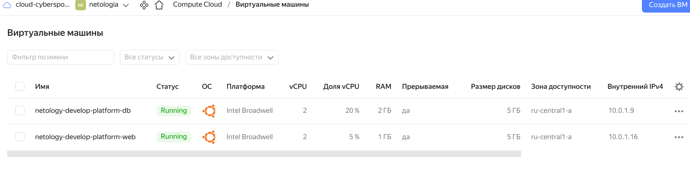

# Домашнее задание к занятию   «Основы Terraform. Yandex Cloud» - `Мартыненко Алексей`

### Задание 0
> 1. Ознакомьтесь с документацией к security-groups в Yandex Cloud.
> 2. Запросите preview доступ к данному функционалу в ЛК Yandex Cloud. Обычно его выдают в течении 24-х часов. https://console.cloud.yandex.ru/folders/<ваш cloud_id>/vpc/security-groups.
> Этот функционал понадобится к следующей лекции.

примечание к описательной части "0" задания, все же в ссылке должен быть идентификатор folder-id а не cloud-id


### Задание 1
> 1. Изучите проект. В файле `variables.tf` объявлены переменные для yandex provider.
> 2. Переименуйте файл personal.auto.tfvars_example в personal.auto.tfvars. Заполните переменные (идентификаторы облака, токен доступа). Благодаря .gitignore этот файл не попадет в публичный репозиторий. Вы можете выбрать иной способ безопасно передать секретные данные в terraform.
> 3. Сгенерируйте или используйте свой текущий ssh ключ. Запишите его открытую часть в переменную vms_ssh_root_key.
> 4. Инициализируйте проект, выполните код. Исправьте возникшую ошибку. Ответьте в чем заключается ее суть?
```shell
- Finding latest version of yandex-cloud/yandex...
  ╷
  │ Error: Invalid provider registry host
  │
  │ The host "registry.terraform.io" given in in provider source address "registry.terraform.io/yandex-cloud/yandex" does not offer a Terraform provider
  │ registry.
  ╵
```
2 пути решения "проблемы". 
    + использовать зеркало от яндекса
    + использовать vpn для получения провайдера с регистра terraform hashicorp (использовал данный вариант, т.к. у меня приватный vpn развернутый в европах)

```shell
lidArgument desc = the specified number of cores is not available on platform "standard-v1"; allowed core number: 2, 4
│
│   with yandex_compute_instance.platform,
│   on main.tf line 15, in resource "yandex_compute_instance" "platform":
│   15: resource "yandex_compute_instance" "platform" {

```
    данный шаблон предполагает использование количество ядер в четном количестве 2,4 etc...

> 5. Ответьте, как в процессе обучения могут пригодиться параметры 

>     `preemptible = true`

     параметр дает возможность принудительно останавливать ВМ в любое время по истечении 24 часов с момента создания ВМ и/или нехватает ресурсов для запуска ВМ
     эта опция снижает стоимость затрат на разворачиваемые ВМ , что важно в процессе обучения

>     `core_fraction=5` в параметрах ВМ? Ответ в документации Yandex cloud.

     данный параметр определяет процентное соотношение выделяемых фактически ресурсов физического ядра ВМ в 1 секунду
     к примеру при выставленном значении 5, виртуальное ядро ВМ будет получать 5мс(5%) от 1с(100%) физического ядра. 
     Этот процент напрямую влияет на стоимость разворачиваемой ВМ, чем выше процент - тем выше стоимость, для обучения 
     можно использовать минимально допустимое значение в 5 (5%)
>

> В качестве решения приложите:

> + скриншот ЛК Yandex Cloud с созданной ВМ,
    

> + скриншот успешного подключения к консоли ВМ через ssh
    

> + ответы на вопросы.

даны выше 


### Задание 2
1. Изучите файлы проекта.
2. Замените все "хардкод" значения для ресурсов yandex_compute_image и yandex_compute_instance на отдельные переменные. К названиям переменных ВМ добавьте в начало префикс vm_web_ . Пример: vm_web_name.
3. Объявите нужные переменные в файле variables.tf, обязательно указывайте тип переменной. Заполните их default прежними значениями из main.tf
4. Проверьте terraform plan (изменений быть не должно).

```shell
╰─➤  terraform plan                                                                                                                                        1 ↵
data.yandex_compute_image.ubuntu: Reading...
yandex_vpc_network.develop: Refreshing state... [id=enpact2d84olbea0borj]
data.yandex_compute_image.ubuntu: Read complete after 3s [id=fd83gfh90hpp3sojs1r3]
yandex_vpc_subnet.develop: Refreshing state... [id=e9b809ufgko62g31u3gl]
yandex_compute_instance.platform: Refreshing state... [id=fhmv2j0o4rdr8s7i237p]

No changes. Your infrastructure matches the configuration.

Terraform has compared your real infrastructure against your configuration and found no differences, so no changes are needed.
```


### Задание 3
> 1. Создайте в корне проекта файл 'vms_platform.tf' . Перенесите в него все переменные первой ВМ.
> 2. Скопируйте блок ресурса и создайте с его помощью вторую ВМ(в файле main.tf): "netology-develop-platform-db" , cores = 2, memory = 2, core_fraction = 20. Объявите ее переменные с префиксом vm_db_ в том же файле('vms_platform.tf').
> 3. Примените изменения.
```shell
yandex_compute_instance.platformDB: Creating...
yandex_compute_instance.platformDB: Still creating... [10s elapsed]
yandex_compute_instance.platformDB: Still creating... [20s elapsed]
yandex_compute_instance.platformDB: Creation complete after 28s [id=fhmj728oces07rj9gg6m]

Apply complete! Resources: 1 added, 0 changed, 0 destroyed.
```



### Задание 4
> 1. Объявите в файле outputs.tf output типа map, содержащий { instance_name = external_ip } для каждой из ВМ.
> 2. Примените изменения.
> 3. В качестве решения приложите вывод значений ip-адресов команды terraform output
```shell
╵
╭─spouk@nbst /opt/s.devops/netologia/netology-hw/ter02/mywork  ‹main*›
╰─➤  terraform refresh
data.yandex_compute_image.ubuntu: Reading...
yandex_vpc_network.develop: Refreshing state... [id=enpact2d84olbea0borj]
data.yandex_compute_image.ubuntu: Read complete after 3s [id=fd83gfh90hpp3sojs1r3]
yandex_vpc_subnet.develop: Refreshing state... [id=e9b809ufgko62g31u3gl]
yandex_compute_instance.platform: Refreshing state... [id=fhmv2j0o4rdr8s7i237p]
yandex_compute_instance.platformDB: Refreshing state... [id=fhmj728oces07rj9gg6m]

Outputs:

vm_external_ip4_addressVM1_db = "158.160.51.51"
vm_external_ip4_addressVM1_web = "158.160.97.21"
╭─spouk@nbst /opt/s.devops/netologia/netology-hw/ter02/mywork  ‹main*›
╰─➤  terraform output
vm_external_ip4_addressVM1_db = "158.160.51.51"
vm_external_ip4_addressVM1_web = "158.160.97.21"
```

### Задание 5
> 1. В файле locals.tf опишите в одном local-блоке имя каждой ВМ, используйте интерполяцию ${..} с несколькими переменными по примеру из лекции.
> 2. Замените переменные с именами ВМ из файла variables.tf на созданные вами local переменные.
> 3. Примените изменения.


### Задание 6
> 1. Вместо использования 3-х переменных ".._cores",".._memory",".._core_fraction" в блоке resources {...}, объедените их в переменные типа map с именами "vm_web_resources" и "vm_db_resources".
> 2. Так же поступите с блоком metadata {serial-port-enable, ssh-keys}, эта переменная должна быть общая для всех ваших ВМ.
> 3. Найдите и удалите все более не используемые переменные проекта.
> 4. Проверьте terraform plan (изменений быть не должно).
```shell
╰─➤  terraform plan
data.yandex_compute_image.ubuntu: Reading...
yandex_vpc_network.develop: Refreshing state... [id=enpact2d84olbea0borj]
data.yandex_compute_image.ubuntu: Read complete after 3s [id=fd83gfh90hpp3sojs1r3]
yandex_vpc_subnet.develop: Refreshing state... [id=e9b809ufgko62g31u3gl]
yandex_compute_instance.platform: Refreshing state... [id=fhmv2j0o4rdr8s7i237p]
yandex_compute_instance.platformDB: Refreshing state... [id=fhmj728oces07rj9gg6m]

No changes. Your infrastructure matches the configuration.
```


Настоятельно рекомендуем выполнять все задания под звёздочкой.
Их выполнение поможет глубже разобраться в материале. Задания под звёздочкой дополнительные (необязательные к выполнению) и никак не повлияют на получение вами зачета по этому домашнему заданию.

### Задание 7*
> 1. Изучите содержимое файла console.tf. Откройте terraform console, выполните следующие задания:

> + Напишите, какой командой можно отобразить второй элемент списка test_list?
```shell
> local.test_list[1]
"staging"
```
> + Найдите длину списка test_list с помощью функции length(<имя переменной>).
```shell
> length(local.test_list)
3
>

```
> + Напишите, какой командой можно отобразить значение ключа admin из map test_map ?
```shell
> {for k,v in local.test_map: k => v if k == "admin" }
{
  "admin" = "John"
}
>
 
```
> + Напишите interpolation выражение, результатом которого будет:
    > "John is admin for production server based on OS ubuntu-20-04 with X vcpu, Y ram and Z virtual disks", 
    > используйте данные из переменных test_list, test_map, servers и функцию length() для подстановки значений. 
```shell
> "John is admin for production server based on OS ubuntu-20-04 with ${local.servers.develop.cpu + local.servers.stage.cpu + local.servers.production.cpu} vcpu, ${local.servers.develop.ram + local.servers.stage.ram + local.servers.production.ram}  ram and ${length(local.servers.develop.disks) + length(local.servers.stage.disks) + length(local.servers.production.disks)} virtual disks"
"John is admin for production server based on OS ubuntu-20-04 with 16 vcpu, 52  ram and 8 virtual disks"
>


```
В качестве решения предоставьте необходимые команды и их вывод.