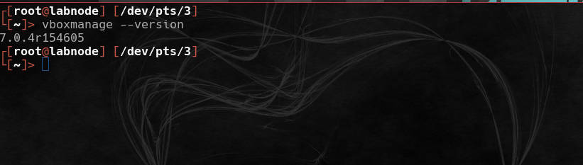
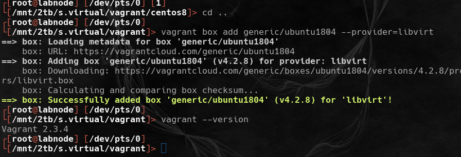
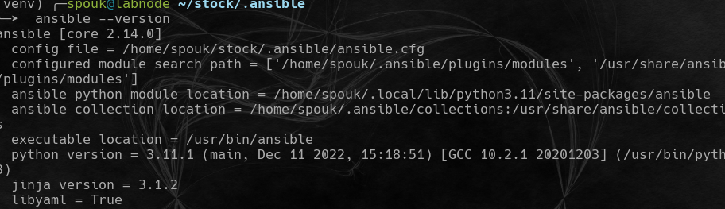
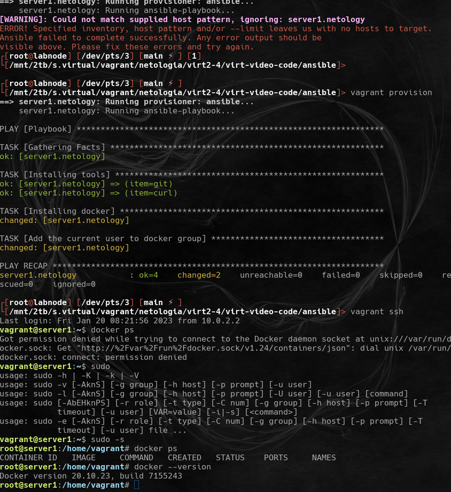

# Домашнее задание к занятию "2. Применение принципов IaaC в работе с виртуальными машинами - `Мартыненко Алексей`

### Задача 1

Опишите своими словами основные преимущества применения на практике IaaC паттернов.
+ скоростное (в сравнении с использованием других методик разработки и внедрения программных продуктов)
"производство" конечного продукта, снижение за счет этого совокупных финансовых затрат (аренда, зарплатный фонд, продвижение и прочее)
+ унификация процесса разработки - единообразный подход при разработке паттернов понятных "всем"   
+ убирание свойства "уникальности" как специалиста, обший подход дает возможность быстрой подготовки кадровой замены для уходящих инженеров
+ значительное снижение "ручной" монотонной и единообразной работы, создание условий для автоматизации рутиных процессов и задач

Какой из принципов IaaC является основополагающим?
идемпотентность 

### Задача 2

Чем Ansible выгодно отличается от других систем управление конфигурациями?
+ низкий порог входа
+ реализован на пайтоне, пайтон как интерпретатор есть на основных дистрибутивах linux + unix (*bsd for ex) и установлен по дефолту
+ push метод для проведения нужных манипуляций с удаленными машинами
+ безагентный подход, когда нет необходимости предварительной установки специализированного агента на удаленной машине для проведения манипуляций с ней 

+ Какой, на ваш взгляд, метод работы систем конфигурации более надёжный push или pull?
оба надежные по результату, push предпочтительнее при однородном составе управляемых машин (пулл из linux only серверов с единым дистрибутивом, centos for ex)
при "зоопарке" ос (pull) -  наличие агента предпочтительнее, т.к. установка агента на удаленной машине практически гарантирует выполнение пулла задач, поступающих от "центра"

### Задача 3

Установить на личный компьютер:

VirtualBox
Vagrant
Ansible
Приложить вывод команд установленных версий каждой из программ, оформленный в markdown.

### Задача 4 (*)

Воспроизвести практическую часть лекции самостоятельно.

Создать виртуальную машину.
Зайти внутрь ВМ, убедиться, что Docker установлен с помощью команды
docker ps

