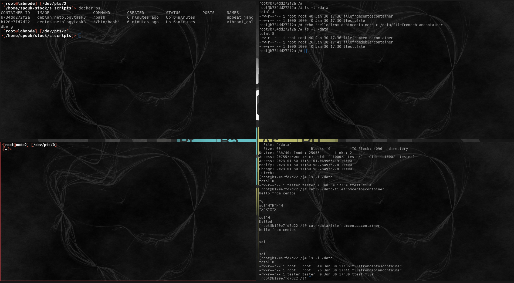

# Домашнее задание к занятию "3. Введение. Экосистема. Архитектура. Жизненный цикл Docker контейнера - `Мартыненко Алексей`


### Задача 1
Сценарий выполения задачи:

создайте свой репозиторий на https://hub.docker.com;
выберете любой образ, который содержит веб-сервер Nginx;
создайте свой fork образа;
реализуйте функциональность: запуск веб-сервера в фоне с индекс-страницей, содержащей HTML-код ниже:
```html
    <html>
    <head>
    Hey, Netology
    </head>
    <body>
    <h1>I’m DevOps Engineer!</h1>
    </body>
    </html>
```
Опубликуйте созданный форк в своем репозитории и предоставьте ответ в виде ссылки на https://hub.docker.com/username_repo.

https://hub.docker.com/r/cyberspouk/cyberspouk/tags


### Задача 2
Посмотрите на сценарий ниже и ответьте на вопрос: "Подходит ли в этом сценарии использование Docker контейнеров или лучше подойдет виртуальная машина, физическая машина? Может быть возможны разные варианты?"

Детально опишите и обоснуйте свой выбор.

--

Сценарий:

Высоконагруженное монолитное java веб-приложение;
 - использование docker контейнеризации в данном случае уместно, причины 
   + виртуальная машина платформонезависимая, по этой причине может быть развернута в рамках контейнера 
   + приложение монолитное, удобно запускать через entrypoint
 Nodejs веб-приложение;
   - использование docker контейнеризации в данном случае уместно, причины
       + node.js интерпретатор прекрасно работает в linux средах, проблем в запуске nodejs web приложение - нет
    
Мобильное приложение c версиями для Android и iOS;
    - виртуальная машина/физическая машина = причина, наличие  билда под  IOS
Шина данных на базе Apache Kafka;
    - развернуть в рамках docker контейнеров можно, но учитывая важность брокера в архитектуре целесообразнее было-бы 
      использовать ВМ/железку
Elasticsearch кластер для реализации логирования продуктивного веб-приложения - три ноды elasticsearch, два logstash и две ноды kibana;
    кластер elk разворачивать на ВМ/железках, а logstah с kibana в docker контейнерах
    + причины - elk будет более шустро работать на "чистой" ВМ/железке 

Мониторинг-стек на базе Prometheus и Grafana;
   - использование docker контейнеризации в данном случае уместно
   + весьма не прожорливые приложения, прекрасно вписываются в концепт микросервисов 

MongoDB, как основное хранилище данных для java-приложения;
 - можно и в docker контейнер разместить, но нужно учитывать объемы данных, количество обращений к базе
 
Gitlab сервер для реализации CI/CD процессов и приватный (закрытый) Docker Registry.
gitlab 
==
 - ВМ/железка
   + причины = CI/CD процессы могут быть весьма прожорливыми
Docker Registry 
   - ВМ/железка, причины - более рациональное решение, учитывая характер хранимых в регистре данных


### Задача 3
Запустите первый контейнер из образа centos c любым тэгом в фоновом режиме, подключив папку /data из текущей рабочей директории на хостовой машине в /data контейнера;
Запустите второй контейнер из образа debian в фоновом режиме, подключив папку /data из текущей рабочей директории на хостовой машине в /data контейнера;
Подключитесь к первому контейнеру с помощью docker exec и создайте текстовый файл любого содержания в /data;
Добавьте еще один файл в папку /data на хостовой машине;
Подключитесь во второй контейнер и отобразите листинг и содержание файлов в /data контейнера.



### Задача 4 (*)
Воспроизвести практическую часть лекции самостоятельно.
Соберите Docker образ с Ansible, загрузите на Docker Hub и пришлите ссылку вместе с остальными ответами к задачам.

https://hub.docker.com/repository/docker/cyberspouk/centosansible


## Доработка вопросы и ответы
#### Задание 1
> Предлагаю уточнить, как произошла замена стартовой страницы.

так как постановка задачи неопределенная в части реализации способа доставки отображаемой страницы я добавлял
```html
    docker cp /tmp/index.html <idcontainer>:usr/share/nginx/html
```
другим вариантом было бы  замещение контейнерного пути /usr/share/nginx  монтированием внешней директории

#### Задание 2
2.1 
> q: в чём смысл контейнеризации монолитного (и высоконагруженного) приложения?

*    атомизация среды исполнения
*    быстрота развертывания
*    возможность масштабирования
*    независимость от среды окружения при соблюдении условий и поддержки использумой системы контейнеризации системой хоста

> Как будет происходить его масштабирование?

развертывание однотипных контейнеров с аналогичными конфигурационным параметрами с выставлением перед пулом таких
конитейнеров балансировщика с "белым" ip, который будет по заданному алгоритму (round-robyn for example) распределять
входящий пулл внешних подключений


