# Домашнее задание к занятию "4. Оркестрация группой Docker контейнеров на примере Docker Compose `Мартыненко Алексей`

### Задача 1
Создать собственный образ любой операционной системы (например, ubuntu-20.04) с помощью Packer (инструкция)
Для получения зачета вам необходимо предоставить скриншот страницы с созданным образом из личного кабинета YandexCloud.
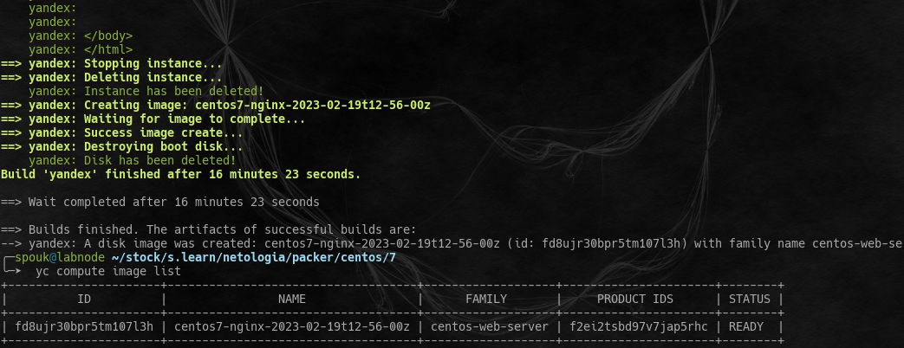
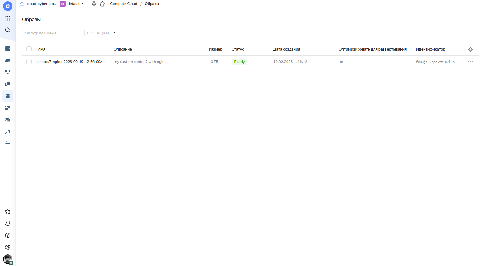

### Задача 2
#### 2.1 Создать вашу первую виртуальную машину в YandexCloud с помощью web-интерфейса YandexCloud.

#### 2.2* (Необязательное задание)
Создать вашу первую виртуальную машину в YandexCloud с помощью terraform (вместо использования веб-интерфейса YandexCloud). Используйте terraform код в директории (src/terraform)
Для получения зачета, вам необходимо предоставить вывод команды terraform apply и страницы свойств созданной ВМ из личного кабинета YandexCloud.

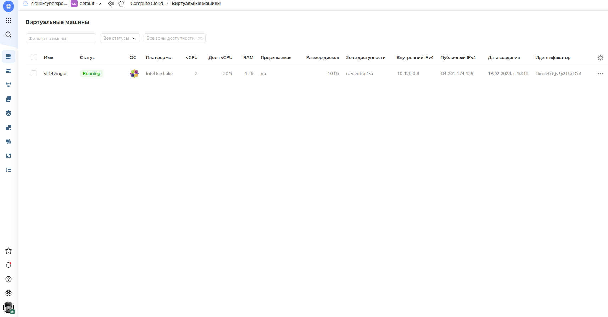
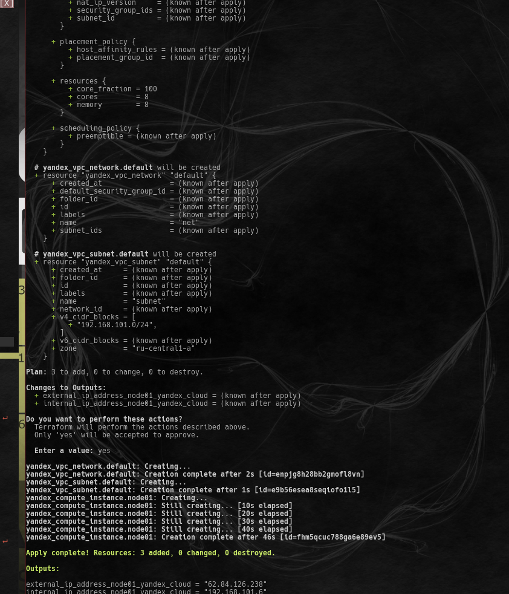
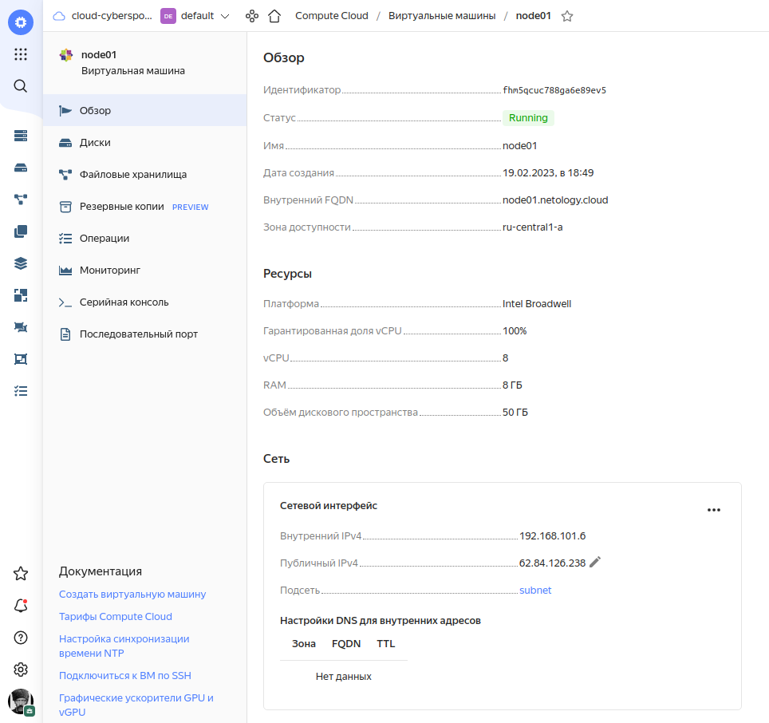

### Задача 3
С помощью ansible и docker-compose разверните на виртуальной машине из предыдущего задания систему мониторинга на основе Prometheus/Grafana . Используйте ansible код в директории (src/ansible)
Для получения зачета вам необходимо предоставить вывод команды "docker ps" , все контейнеры, описанные в (docker-compose), должны быть в статусе "Up".
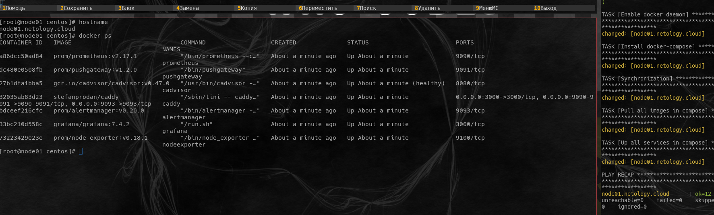

### Задача 4
Откройте веб-браузер, зайдите на страницу http://<внешний_ip_адрес_вашей_ВМ>:3000.
Используйте для авторизации логин и пароль из (.env-file).
Изучите доступный интерфейс, найдите в интерфейсе автоматически созданные docker-compose панели с графиками(dashboards).
Подождите 5-10 минут, чтобы система мониторинга успела накопить данные.
Для получения зачета, вам необходимо предоставить:
Скриншот работающего веб-интерфейса Grafana с текущими метриками, как на примере ниже
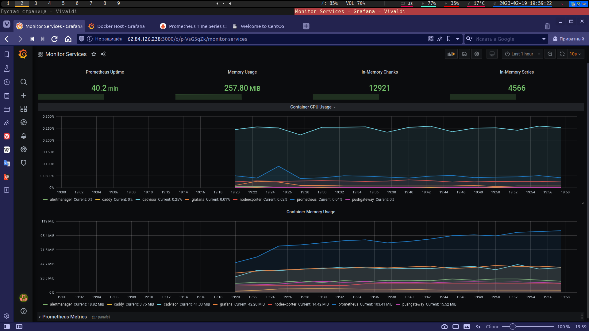
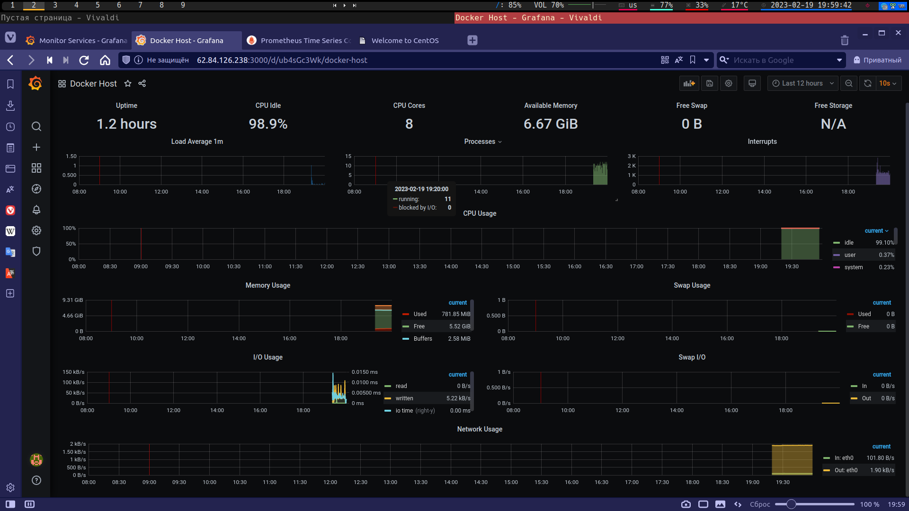

### Задача 5 (*)
Создать вторую ВМ и подключить её к мониторингу развёрнутому на первом сервере.
Для получения зачета, вам необходимо предоставить:
Скриншот из Grafana, на котором будут отображаться метрики добавленного вами сервера.

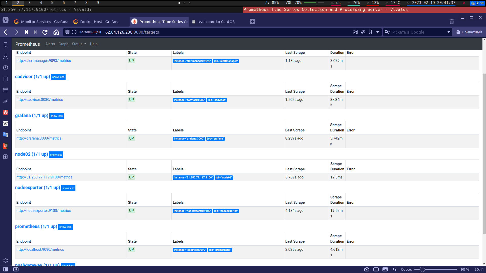
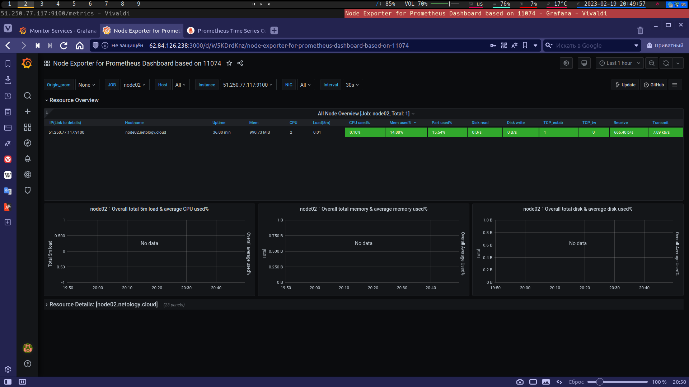
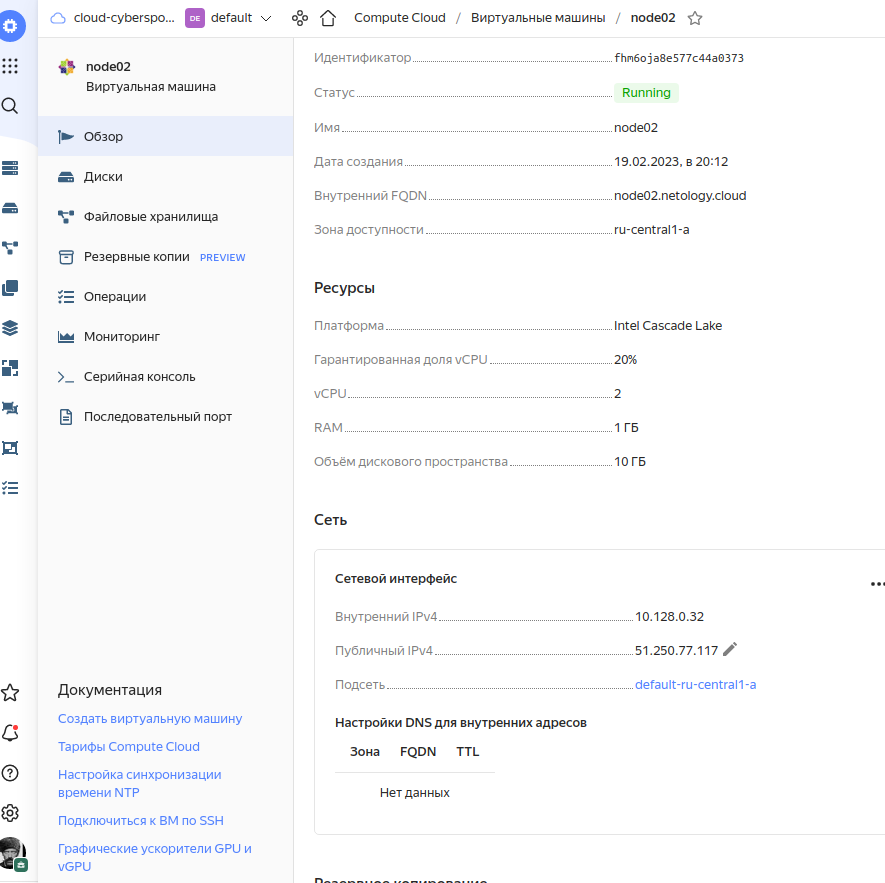
