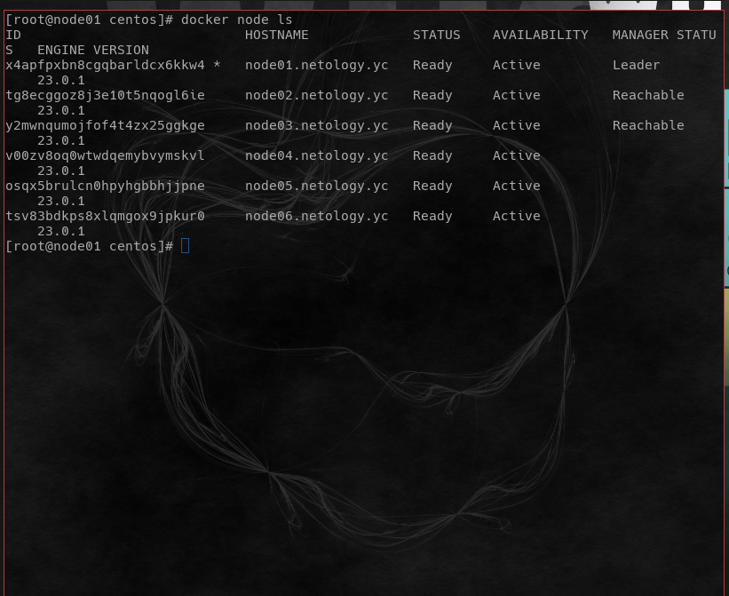
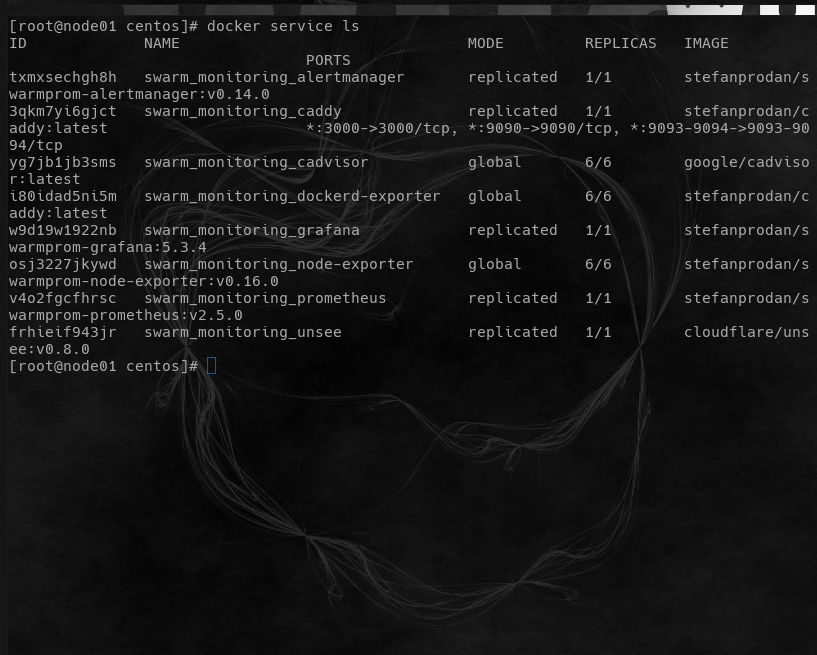
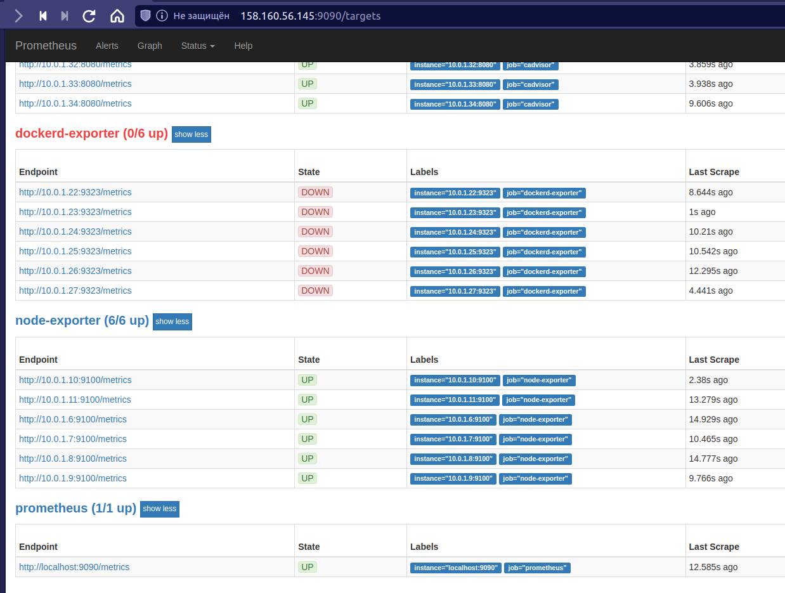
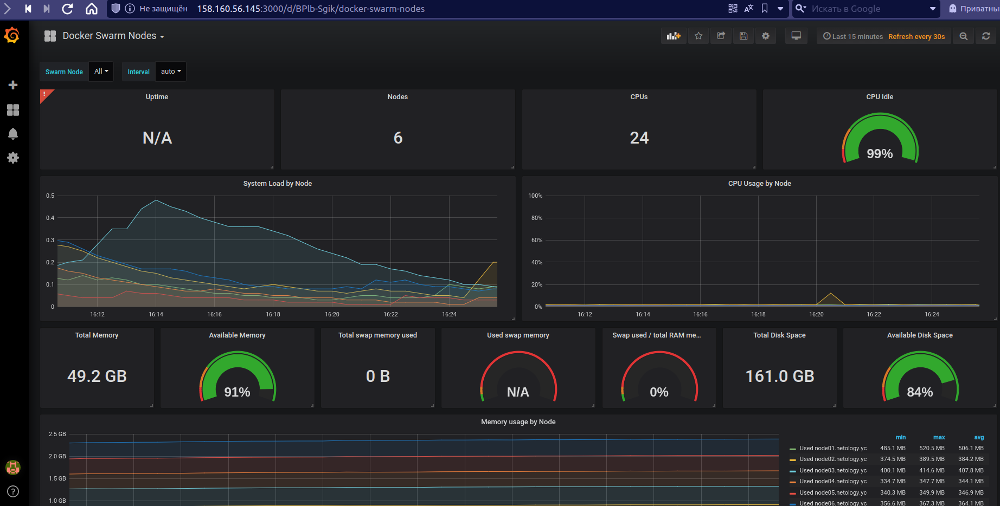

# Домашнее задание к занятию "5. Оркестрация кластером Docker контейнеров на примере Docker Swarm `Мартыненко Алексей`


### Задача 1
Дайте письменые ответы на следующие вопросы:

> В чём отличие режимов работы сервисов в Docker Swarm кластере: replication и global?

```html
    replication - механизм, при котором сервис(ы) запускаемые в рамках нод, идентичны. Призван увеличить 
                 отказоустойчивость сервиса(ов) в проде по максимум

    global - развертывания одного сервиса(ов) на одной ноде, в единичном экземпляре, используется как правило для 
             сопутствующих сервисов - мониторинг, сбор логов и etc...
```
> Какой алгоритм выбора лидера используется в Docker Swarm кластере?
```html
    алгоритм поддержания распределенного консенсуса — Raft
```

> Что такое Overlay Network?
```html
    логическая надстройка над стандартами протоколов используемых на 2,3,4,7 уровнях модели osi
    применительно к docker swarm - дает возможность создания коммуникации между участниками кластера
    без привязки к железу/хосту, где развернуты ноды/менеджеры, единственное условие - наличие 
    "стандартной" сетевой доступности хоста, где развернута нода/менеджер 
```

### Задача 2
Создать ваш первый Docker Swarm кластер в Яндекс.Облаке

Для получения зачета, вам необходимо предоставить скриншот из терминала (консоли), с выводом команды:

docker node ls



### Задача 3
Создать ваш первый, готовый к боевой эксплуатации кластер мониторинга, состоящий из стека микросервисов.

Для получения зачета, вам необходимо предоставить скриншот из терминала (консоли), с выводом команды:

docker service ls





### Задача 4 (*)
Выполнить на лидере Docker Swarm кластера команду (указанную ниже) и дать письменное описание её функционала, что она делает и зачем она нужна:

# см.документацию: https://docs.docker.com/engine/swarm/swarm_manager_locking/
docker swarm update --autolock=true


обмен "служебной" и приватной информации в рамках кластера (управляющими нодами - менеджерами)
проходит с использованием журналов raft. Журнал зашифрован TLS ключем, который размещается
в памяти + на диске  каждой управляющей ноды кластера. Любые манипуляции со структурой 
кластера + либо выхода из строя управляющей ноды (лидера), при выключенной автоблокировке
не блокирует кластер. При включении этой опции такой выход из строя управляющей ноды 
блочит кластер, и для того, чтобы его разблокировать надо использовать код, который генерится
при задании этой опции, иначе сервисы и кластер будет неактивный и не доступный.


