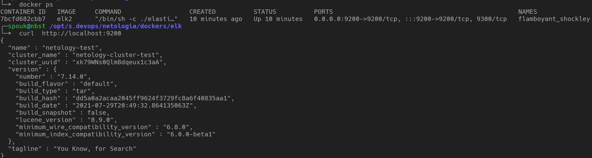

# Домашнее задание к занятию "6.5 «Elasticsearch» `Мартыненко Алексей`


### Задача 1
В этом задании вы потренируетесь в:

установке Elasticsearch,
первоначальном конфигурировании Elasticsearch,
запуске Elasticsearch в Docker.
Используя Docker-образ centos:7 как базовый и документацию по установке и запуску Elastcisearch:

составьте Dockerfile-манифест для Elasticsearch,
соберите Docker-образ и сделайте push в ваш docker.io-репозиторий,
запустите контейнер из получившегося образа и выполните запрос пути / c хост-машины.
Требования к elasticsearch.yml:

данные path должны сохраняться в /var/lib,
имя ноды должно быть netology_test.
В ответе приведите:

текст Dockerfile-манифеста,
ссылку на образ в репозитории dockerhub,
ответ Elasticsearch на запрос пути / в json-виде.
Подсказки:

возможно, вам понадобится установка пакета perl-Digest-SHA для корректной работы пакета shasum,
при сетевых проблемах внимательно изучите кластерные и сетевые настройки в elasticsearch.yml,
при некоторых проблемах вам поможет Docker-директива ulimit,
Elasticsearch в логах обычно описывает проблему и пути её решения.
Далее мы будем работать с этим экземпляром Elasticsearch.


по причине свинского и неадекватного поведения  компании elastic, которая внесла в
черные списки все диапазоны ip адресов постсоветского пространства + все более-менее
известные пулы ip адресов, предоставляющих публичные платные услуги по анонимайзингу
подключений, пришлось развернуть свою репу с последней и другими меньшими версиями 
elk стека (repo.spouk.ru) 
это ответ (если вдруг возникнет) откуда тяну пакет с elasticsearch


```Dockerfile
FROM centos:7
RUN yum install wget perl-Digest-SHA ss mc -y
RUN useradd es
RUN mkdir /var/lib/data;chown es:es -R /var/lib/data
WORKDIR /home/es
RUN wget http://185.204.0.110/elk/elasticsearch-7.14.0-linux-x86_64.tar.gz  && \
tar -xzf elasticsearch-7.14.0-linux-x86_64.tar.gz
COPY ./elasticsearch.yml /home/es/elasticsearch-7.14.0/config/elasticsearch.yml
COPY ./jvm.options  /home/es/elasticsearch-7.14.0/config/jvm.options
RUN chown es:es -R /home/es
EXPOSE 9200
EXPOSE 9300
ENV ES_HOME=/home/es/elasticsearch-7.14.0
USER es
ENTRYPOINT ./elasticsearch-7.14.0/bin/elasticsearch
```
```yaml
#--------------------------
# --> elasticsearch.yml
#--------------------------
cluster.name: netology-cluster-test
node.name: netology-test
path.data: /var/lib/data
http.port: 9200
discovery.type: single-node
transport.publish_host: 0.0.0.0
transport.bind_host: 0.0.0.0
network.host: 0.0.0.0
network.publish_host: 0.0.0.0
xpack.security.enabled: false 
xpack.license.self_generated.type: basic 
xpack.security.transport.ssl.enabled: false
```
```yaml
#--------------------------
# --> jvm.options
#--------------------------
-Xms4g
-Xmx4g
8-13:-XX:+UseConcMarkSweepGC
8-13:-XX:CMSInitiatingOccupancyFraction=75
8-13:-XX:+UseCMSInitiatingOccupancyOnly
14-:-XX:+UseG1GC
-Djava.io.tmpdir=${ES_TMPDIR}
-XX:+HeapDumpOnOutOfMemoryError
-XX:HeapDumpPath=data
-XX:ErrorFile=logs/hs_err_pid%p.log
8:-XX:+PrintGCDetails
8:-XX:+PrintGCDateStamps
8:-XX:+PrintTenuringDistribution
8:-XX:+PrintGCApplicationStoppedTime
8:-Xloggc:logs/gc.log
8:-XX:+UseGCLogFileRotation
8:-XX:NumberOfGCLogFiles=32
8:-XX:GCLogFileSize=64m
9-:-Xlog:gc*,gc+age=trace,safepoint:file=logs/gc.log:utctime,pid,tags:filecount=32,filesize=64m
```



### link to image from hub.docker.com
[docker image --> https://hub.docker.com/r/cyberspouk/cos7elastic/tags](https://hub.docker.com/r/cyberspouk/cos7elastic/tags)


### Задача 2
В этом задании вы научитесь:

создавать и удалять индексы,
изучать состояние кластера,
обосновывать причину деградации доступности данных.

> Ознакомьтесь с документацией и добавьте в Elasticsearch 3 индекса в соответствии с таблицей:

Имя	Количество реплик	Количество шард
ind-1	0	1
ind-2	1	2
ind-3	2	4

```shell
curl -X PUT "localhost:9200/ind-1?pretty" -H 'Content-Type: application/json' -d'
{
  "settings": {
    "number_of_shards": 1,
    "number_of_replicas": 0
  }
}
'
curl -X PUT "localhost:9200/ind-2?pretty" -H 'Content-Type: application/json' -d'
{
  "settings": {
    "number_of_replicas": 1, 
    "number_of_shards": 2
  }
}
'
curl -X PUT "localhost:9200/ind-3?pretty" -H 'Content-Type: application/json' -d'
{
  "settings": {
    "number_of_replicas": 2,
    "number_of_shards": 4
  }
}
'
```

> Получите список индексов и их статусов, используя API, и приведите в ответе на задание.
```shell
╭─spouk@nbst /opt/s.pic/printscreen
╰─➤  curl -get "http://localhost:9200/_cat/indices"
green  open .geoip_databases xHNm9WwbRZiA--V7VKWIOw 1 0 42 0 40mb 40mb
green  open ind-1            yyb6wR-XSxOkvLKtNbg-tA 1 0  0 0 208b 208b
yellow open ind-3            yW3wBCJzSJSHcu4QXLMdtA 4 2  0 0 208b 208b
yellow open ind-2            geboqg6RS3StqroJ6hkOFw 2 1  0 0 208b 208b
```

> Получите состояние кластера Elasticsearch, используя API.
```shell
╭─spouk@nbst /opt/s.pic/printscreen
╰─➤  curl -get "http://localhost:9200/_cluster/health?pretty"
{
  "cluster_name" : "netology-cluster-test",
  "status" : "yellow",
  "timed_out" : false,
  "number_of_nodes" : 1,
  "number_of_data_nodes" : 1,
  "active_primary_shards" : 8,
  "active_shards" : 8,
  "relocating_shards" : 0,
  "initializing_shards" : 0,
  "unassigned_shards" : 10,
  "delayed_unassigned_shards" : 0,
  "number_of_pending_tasks" : 0,
  "number_of_in_flight_fetch" : 0,
  "task_max_waiting_in_queue_millis" : 0,
  "active_shards_percent_as_number" : 44.44444444444444
}
```

> Как вы думаете, почему часть индексов и кластер находятся в состоянии yellow?
причина -> discovery.type: single-node
кластер запущен в режиме одиночной ноды, данным некуда реплицироваться

> Удалите все индексы.
```shell
╭─spouk@nbst /opt/s.pic/printscreen
╰─➤  curl -X DELETE "localhost:9200/_all?pretty"
{
  "acknowledged" : true
}

```


Важно
При проектировании кластера Elasticsearch нужно корректно рассчитывать количество реплик и шард, иначе возможна потеря данных индексов, вплоть до полной, при деградации системы.


### Задача 3
В этом задании вы научитесь:

создавать бэкапы данных,
восстанавливать индексы из бэкапов.
> Создайте директорию {путь до корневой директории с Elasticsearch в образе}/snapshots.
```shell
[es@7bcfd682cbb7 elasticsearch-7.14.0]$ pwd
/home/es/elasticsearch-7.14.0
[es@7bcfd682cbb7 elasticsearch-7.14.0]$ ls -la
total 612
drwxr-xr-x 1 es es     38 May  6 21:55 .
drwx------ 1 es es     78 May  6 21:54 ..
-rw-r--r-- 1 es es   3860 Jul 29  2021 LICENSE.txt
-rw-r--r-- 1 es es 615722 Jul 29  2021 NOTICE.txt
-rw-r--r-- 1 es es   2710 Jul 29  2021 README.asciidoc
drwxr-xr-x 1 es es    968 Jul 29  2021 bin
drwxr-xr-x 1 es es     44 May  5 22:14 config
drwxr-xr-x 1 es es     74 Jul 29  2021 jdk
drwxr-xr-x 1 es es   1998 Jul 29  2021 lib
drwxr-xr-x 1 es es    906 May  6 01:30 logs
drwxr-xr-x 1 es es   1636 Jul 29  2021 modules
drwxr-xr-x 1 es es      0 Jul 29  2021 plugins
drwxrwxr-x 1 es es      0 May  6 21:55 snapshots
[es@7bcfd682cbb7 elasticsearch-7.14.0]$
```

Используя API, зарегистрируйте эту директорию как snapshot repository c именем netology_backup.
```shell
curl -X PUT "localhost:9200/_snapshot/netology_backup?pretty" -H 'Content-Type: application/json' -d'
{
  "type": "fs",
  "settings": {
    "location": "/home/es/elasticsearch-7.14.0/snapshot"        
  }
}
'
```

Приведите в ответе запрос API и результат вызова API для создания репозитория.
```shell
╰─➤  curl http://localhost:9200                                                                                                                           56 ↵
{
  "name" : "netology-test",
  "cluster_name" : "netology-cluster-test",
  "cluster_uuid" : "ISo_wJMvTBmvtdHkL4XOEA",
  "version" : {
    "number" : "7.14.0",
    "build_flavor" : "default",
    "build_type" : "tar",
    "build_hash" : "dd5a0a2acaa2045ff9624f3729fc8a6f40835aa1",
    "build_date" : "2021-07-29T20:49:32.864135063Z",
    "build_snapshot" : false,
    "lucene_version" : "8.9.0",
    "minimum_wire_compatibility_version" : "6.8.0",
    "minimum_index_compatibility_version" : "6.0.0-beta1"
  },
  "tagline" : "You Know, for Search"
}
╭─spouk@nbst /opt/s.devops/netologia/dockers/elk
╰─➤  curl -X PUT "localhost:9200/_snapshot/netology_backup?pretty" -H 'Content-Type: application/json' -d'
{
  "type": "fs",
  "settings": {
    "location": "/home/es/elasticsearch-7.14.0/snapshot"
  }
}
'
{
  "acknowledged" : true
}

```
Создайте индекс test с 0 реплик и 1 шардом и приведите в ответе список индексов.
```shell
curl -X PUT "localhost:9200/test?pretty" -H 'Content-Type: application/json' -d'
{
  "settings": {
    "number_of_shards": 1,
    "number_of_replicas": 0
  }
}
'
╰─➤  curl -X PUT "localhost:9200/test?pretty" -H 'Content-Type: application/json' -d'
{
  "settings": {
    "number_of_shards": 1,
    "number_of_replicas": 0
  }
}
'

{
  "acknowledged" : true,
  "shards_acknowledged" : true,
  "index" : "test"
}

```
Создайте snapshot состояния кластера Elasticsearch.
```shell
# PUT _snapshot/my_repository/<my_snapshot_{now/d}>
curl -X PUT "localhost:9200/_snapshot/netology_backup/%3Cfsnapshot%7Bnow%2Fd%7D%3E?pretty"

```
Приведите в ответе список файлов в директории со snapshot.
```shell
╰─➤  curl -X PUT "localhost:9200/_snapshot/netology_backup/%3Cfsnapshot%7Bnow%2Fd%7D%3E?pretty"
{
  "accepted" : true
}
╭─spouk@nbst /opt/s.devops/netologia/dockers/elk
╰─➤  docker exec  -it $(docker ps -ql) bash
[es@6fa8d3c112c9 ~]$ cd elasticsearch-7.14.0/
LICENSE.txt      README.asciidoc  config/          lib/             modules/         snapshot/
NOTICE.txt       bin/             jdk/             logs/            plugins/
[es@6fa8d3c112c9 ~]$ cd elasticsearch-7.14.0/snapshot/
[es@6fa8d3c112c9 snapshot]$ ls -la
total 44
drwxr-xr-x 1 es es   176 May  6 22:41 .
drwxr-xr-x 1 es es    36 May  6 22:33 ..
-rw-r--r-- 1 es es   837 May  6 22:41 index-0
-rw-r--r-- 1 es es     8 May  6 22:41 index.latest
drwxr-xr-x 1 es es    88 May  6 22:41 indices
-rw-r--r-- 1 es es 27672 May  6 22:41 meta-kBRr6gjMTWCKSwfbX_cH2w.dat
-rw-r--r-- 1 es es   446 May  6 22:41 snap-kBRr6gjMTWCKSwfbX_cH2w.dat
[es@6fa8d3c112c9 snapshot]$
```
Удалите индекс test и создайте индекс test-2. Приведите в ответе список индексов.
```shell
╰─➤  curl -X DELETE "localhost:9200/test?pretty"
{
  "acknowledged" : true
}

╰─➤  curl -X PUT "localhost:9200/test-2?pretty" -H 'Content-Type: application/json' -d'
{
  "settings": {
    "number_of_shards": 1,
    "number_of_replicas": 0
  }
}
'

{
  "acknowledged" : true,
  "shards_acknowledged" : true,
  "index" : "test-2"
}
```
> Восстановите состояние кластера Elasticsearch из snapshot, созданного ранее.
> Приведите в ответе запрос к API восстановления и итоговый список индексов.

```shell
╰─➤  curl -X GET "localhost:9200/_cat/snapshots/netology_backup"
fsnapshot2023.05.06 netology_backup SUCCESS 1683412863 22:41:03 1683412864 22:41:04 1s 2 2 0 2


╰─➤  curl -X GET "localhost:9200/_snapshot/netology_backup/fsnapshot2023.05.06?pretty"
{
  "snapshots" : [
    {
      "snapshot" : "fsnapshot2023.05.06",
      "uuid" : "kBRr6gjMTWCKSwfbX_cH2w",
      "repository" : "netology_backup",
      "version_id" : 7140099,
      "version" : "7.14.0",
      "indices" : [
        "test",
        ".geoip_databases"
      ],
      "data_streams" : [ ],
      "include_global_state" : true,
      "state" : "SUCCESS",
      "start_time" : "2023-05-06T22:41:03.435Z",
      "start_time_in_millis" : 1683412863435,
      "end_time" : "2023-05-06T22:41:04.436Z",
      "end_time_in_millis" : 1683412864436,
      "duration_in_millis" : 1001,
      "failures" : [ ],
      "shards" : {
        "total" : 2,
        "failed" : 0,
        "successful" : 2
      },
      "feature_states" : [
        {
          "feature_name" : "geoip",
          "indices" : [
            ".geoip_databases"
          ]
        }
      ]
    }
  ]
}


curl -X POST "localhost:9200/_snapshot/netology_backup/fsnapshot2023.05.06/_restore?pretty" -H 'Content-Type: application/json' -d'
{
  "indices": "test"
}
'


╭─spouk@nbst /opt/s.devops/netologia/dockers/elk
╰─➤  curl -get "http://localhost:9200/_cat/indices"
green open .geoip_databases ValZ69aSRyC2L4vccXGuug 1 0 42 0 40mb 40mb
green open test-2           R28NlMf_RlSK3sKM6Bnxdg 1 0  0 0 208b 208b
green open test             m3sNstlrRoa6aYIzPfzpmQ 1 0  0 0 208b 208b

```
