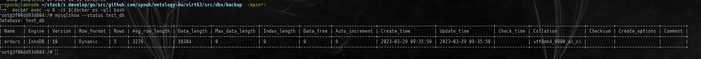
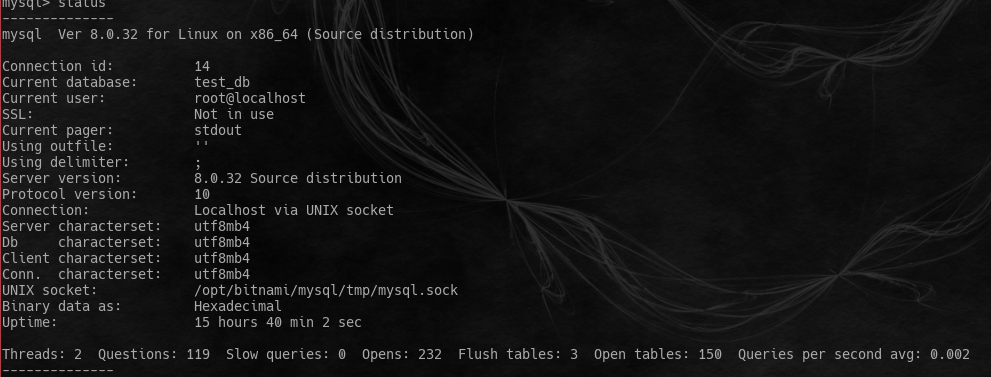
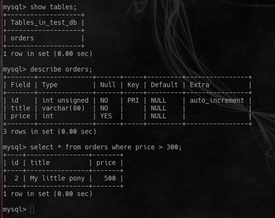

# Домашнее задание к занятию "6.3 MYSQL `Мартыненко Алексей`


### Задача 1
Используя Docker, поднимите инстанс MySQL (версию 8). Данные БД сохраните в volume.

Изучите бэкап БД и восстановитесь из него.

Перейдите в управляющую консоль mysql внутри контейнера.

Используя команду \h, получите список управляющих команд.

Найдите команду для выдачи статуса БД и приведите в ответе из её вывода версию сервера БД.

Подключитесь к восстановленной БД и получите список таблиц из этой БД.

Приведите в ответе количество записей с price > 300.

В следующих заданиях мы будем продолжать работу с этим контейнером.
```dockerfile
version: "3"

networks:
  app-tier:
    driver: bridge

services:
  mysql:
    image: 'bitnami/mysql:8.0'
    container_name: mysql-db1
    ports:
      - '3333:3306'
    environment:
        - ALLOW_EMPTY_PASSWORD=yes
    volumes:
      - /home/spouk/stock/s.develop/go/src/github.com/spouk/netology-hw/virt63/src/dbs/data:/bitnami/mysql/data
      - /home/spouk/stock/s.develop/go/src/github.com/spouk/netology-hw/virt63/src/dbs/backup:/bitnami/backup
#      - /home/spouk/stock/s.develop/go/src/github.com/spouk/netology-hw/virt63/src/dbs/conf:/opt/bitnami/mysql/conf
    networks:
        - app-tier
    restart: always

```







### Задача 2
Создайте пользователя test в БД c паролем test-pass, используя:

* плагин авторизации mysql_native_password
* срок истечения пароля — 180 дней
* количество попыток авторизации — 3
* максимальное количество запросов в час — 100
   * аттрибуты пользователя:
     * Фамилия "Pretty"
     * Имя "James".

Предоставьте привелегии пользователю test на операции SELECT базы test_db.

```sql92
CREATE USER if not exists 'test'@'%' IDENTIFIED WITH mysql_native_password BY 'test-pass' WITH MAX_QUERIES_PER_HOUR  100 password expire interval 180 day FAILED_LOGIN_ATTEMPTS 3 attribute '{"firstname":"James", "lastname":"Pretty"}';
grant select  ON test_db.* to 'test'@'%';
flush privileges;
```

Используя таблицу INFORMATION_SCHEMA.USER_ATTRIBUTES, получите данные по пользователю test и приведите в ответе к задаче.

```sql92
SELECT * FROM INFORMATION_SCHEMA.USER_ATTRIBUTES WHERE USER='test';
+------+------+----------------------------------------------+
| USER | HOST | ATTRIBUTE                                    |
+------+------+----------------------------------------------+
| test | %    | {"lastname": "Pretty", "firstname": "James"} |
+------+------+----------------------------------------------+
1 row in set (0.01 sec)

mysql>
```

### Задача 3
Установите профилирование SET profiling = 1. Изучите вывод профилирования команд SHOW PROFILES;.

Исследуйте, какой engine используется в таблице БД test_db и приведите в ответе.

```sql92
mysql> show create table orders;
+--------+-------------------------------------------------------------------------------------------------------------------------------------------------------------------------------------------------------------------------------------------+
| Table  | Create Table                                                                                                                                                                                                                              |
+--------+-------------------------------------------------------------------------------------------------------------------------------------------------------------------------------------------------------------------------------------------+
| orders | CREATE TABLE `orders` (
  `id` int unsigned NOT NULL AUTO_INCREMENT,
  `title` varchar(80) NOT NULL,
  `price` int DEFAULT NULL,
  PRIMARY KEY (`id`)
) ENGINE=InnoDB AUTO_INCREMENT=6 DEFAULT CHARSET=utf8mb4 COLLATE=utf8mb4_0900_ai_ci |
+--------+-------------------------------------------------------------------------------------------------------------------------------------------------------------------------------------------------------------------------------------------+

```

Измените engine и приведите время выполнения и запрос на изменения из профайлера в ответе:
* на MyISAM,
* на InnoDB.

```sql92
mysql> alter table orders engine = myisam;
Query OK, 5 rows affected (0.02 sec)
Records: 5  Duplicates: 0  Warnings: 0

mysql> show profile;
+--------------------------------+----------+
| Status                         | Duration |
+--------------------------------+----------+
| starting                       | 0.000066 |
| Executing hook on transaction  | 0.000006 |
| starting                       | 0.000026 |
| checking permissions           | 0.000008 |
| checking permissions           | 0.000005 |
| init                           | 0.000015 |
| Opening tables                 | 0.000250 |
| setup                          | 0.000094 |
| creating table                 | 0.000572 |
| waiting for handler commit     | 0.000009 |
| waiting for handler commit     | 0.001590 |
| After create                   | 0.000373 |
| System lock                    | 0.000019 |
| copy to tmp table              | 0.000093 |
| waiting for handler commit     | 0.000010 |
| waiting for handler commit     | 0.000018 |
| waiting for handler commit     | 0.000027 |
| rename result table            | 0.000075 |
| waiting for handler commit     | 0.004156 |
| waiting for handler commit     | 0.000021 |
| waiting for handler commit     | 0.001757 |
| waiting for handler commit     | 0.000019 |
| waiting for handler commit     | 0.003935 |
| waiting for handler commit     | 0.000019 |
| waiting for handler commit     | 0.000794 |
| end                            | 0.001794 |
| query end                      | 0.000673 |
| closing tables                 | 0.000016 |
| waiting for handler commit     | 0.000030 |
| freeing items                  | 0.000023 |
| cleaning up                    | 0.000027 |
+--------------------------------+----------+
31 rows in set, 1 warning (0.00 sec)

```

```sql92
mysql> alter table orders engine = innodb;
Query OK, 5 rows affected (0.02 sec)
Records: 5  Duplicates: 0  Warnings: 0

mysql> show profile;
+--------------------------------+----------+
| Status                         | Duration |
+--------------------------------+----------+
| starting                       | 0.000070 |
| Executing hook on transaction  | 0.000015 |
| starting                       | 0.000019 |
| checking permissions           | 0.000003 |
| checking permissions           | 0.000007 |
| init                           | 0.000013 |
| Opening tables                 | 0.000205 |
| setup                          | 0.000048 |
| creating table                 | 0.000070 |
| After create                   | 0.006084 |
| System lock                    | 0.000027 |
| copy to tmp table              | 0.000059 |
| rename result table            | 0.000808 |
| waiting for handler commit     | 0.000011 |
| waiting for handler commit     | 0.001442 |
| waiting for handler commit     | 0.000013 |
| waiting for handler commit     | 0.006006 |
| waiting for handler commit     | 0.000018 |
| waiting for handler commit     | 0.001689 |
| waiting for handler commit     | 0.000015 |
| waiting for handler commit     | 0.000608 |
| end                            | 0.000391 |
| query end                      | 0.000538 |
| closing tables                 | 0.000005 |
| waiting for handler commit     | 0.000020 |
| freeing items                  | 0.000017 |
| cleaning up                    | 0.000029 |
+--------------------------------+----------+
27 rows in set, 1 warning (0.00 sec)

```


### Задача 4
Изучите файл my.cnf в директории /etc/mysql.

Измените его согласно ТЗ (движок InnoDB):

* скорость IO важнее сохранности данных;
* нужна компрессия таблиц для экономии места на диске;
* размер буффера с незакомиченными транзакциями 1 Мб;
* буффер кеширования 30% от ОЗУ;
* размер файла логов операций 100 Мб.

Приведите в ответе изменённый файл my.cnf.

```shell
╰─➤  cat my.cnf
[mysqladmin]
user=

[mysqld]
skip_name_resolve
explicit_defaults_for_timestamp
basedir=/opt/bitnami/mysql
port=3306
tmpdir=/opt/bitnami/mysql/tmp
socket=/opt/bitnami/mysql/tmp/mysql.sock
pid_file=/opt/bitnami/mysql/tmp/mysqld.pid
max_allowed_packet=16M
bind_address=0.0.0.0
log_error=/opt/bitnami/mysql/logs/mysqld.log
slow_query_log=0
slow_query_log_file=/opt/bitnami/mysql/logs/mysqld.log
long_query_time=10.0
character_set_server=utf8mb4
collation_server=utf8mb4_unicode_ci
plugin_dir=/opt/bitnami/mysql/lib/plugin

# - io
# сброс транзакций на диск раз в секунду, это дает риск потери , но при этом получается сильный буст при обработке транзакций
 innodb_flush_log_at_trx_commit=2
# кэш, который не нужен, сколько памяти выделять под кэш запросов, использование этого механизма _снижает_ io
 query_cache_size=0
# - pack
# разбивка хранения информации по каждой таблице в отдельном файле
 innodb_file_per_table=1
# формат файлов innodb с поддержкой компрессии
 innodb_file_format=Barracuda
# - pretransactions buffer
 transaction_prealloc_size=1M
# - memory pool
# выделение буфера из рамы под индексы,данные
 innodb_buffer_pool_size=14G
# - log size
# определение размер логфайла, чем больше размер тем быстрее запись, минус - при падении увеличение времени восстановления пропорциально размеру
 innodb_log_file_size=100M
[client]
port=3306
socket=/opt/bitnami/mysql/tmp/mysql.sock
default_character_set=utf8mb4
plugin_dir=/opt/bitnami/mysql/lib/plugin

[manager]
port=3306
socket=/opt/bitnami/mysql/tmp/mysql.sock
pid_file=/opt/bitnami/mysql/tmp/mysqld.pid

```


### upd: доработка

> q:
    Здравствуйте, Алексей!
    Спасибо за выполненную работу.
    Практически все сделано верно, небольшое замечание по 4 заданию, почему innodbbufferpool_size=14? Может стоит сделать больше?
    Прошу доработать!

исходя из постановки задачи 
 > буффер кеширования 30% от ОЗУ;


расчет размера производился по формуле размер RAM / 30 * 100 
учитывая, что на железе, где я разворачивал контейнер количество RAM
```shell
╰─➤  free -g
               total        used        free      shared  buff/cache   available
Mem:              47          32           0           3          13           9
Swap:              0           0           0

```
то 30% от этого размера будет = 30% или 14G 
